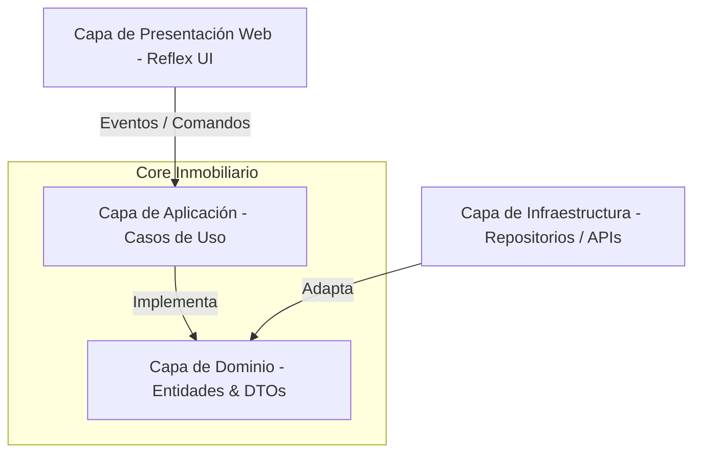

# 🏢 Sistema Core de Gestión Inmobiliaria Velar (Velar Core System)

[](https://www.python.org/)
[](https://reflex.dev/)
[](https://www.postgresql.org/)
[]()
[](LICENSE)

> Plataforma transaccional de alto rendimiento diseñada para la automatización integral de procesos inmobiliarios bajo principios de Arquitectura Limpia y patrones de diseño empresariales (Domain-Driven Design).

---

## 📑 Índice Arquitectónico

1. [Visión General de la Plataforma](#1-visión-general-de-la-plataforma)
2. [Arquitectura del Sistema (Clean Architecture)](#2-arquitectura-del-sistema-clean-architecture)
3. [Stack Tecnológico Base](#3-stack-tecnológico-base)
4. [Módulos Core del Negocio](#4-módulos-core-del-negocio)
5. [Modelo de Datos e Infraestructura](#5-modelo-de-datos-e-infraestructura)
6. [Guía Rápida de Despliegue Entorno Local](#6-guía-rápida-de-despliegue-entorno-local)
7. [Políticas de Calidad y Pruebas (QA)](#7-políticas-de-calidad-y-pruebas-qa)
8. [Directrices de Ingeniería (Guidelines)](#8-directrices-de-ingeniería-guidelines)

---

## 1. Visión General de la Plataforma

El sistema Velar constituye el núcleo operativo de la gestión inmobiliaria. Orquesta procesos críticos que abarcan desde la persistencia de portafolios de propiedades, ciclo de vida de contratos (Mandato y Arrendamiento), hasta motores de liquidación financiera y flujos de auditoría. Diseñado para garantizar **escalabilidad horizontal**, **tolerancia a fallos** y **consistencia transaccional**.

### Capacidades Empresariales
* **Motor Documental**: Generación asíncrona de contratos y reportes PDF.
* **Motor Financiero**: Procesamiento por lotes de liquidaciones, cálculos de comisiones e indexación IPC automatizada.
* **RBAC Avanzado**: Control de Acceso Basado en Roles hiper-granular (Administradores, Gerentes, Asesores).
* **Trazabilidad Absoluta**: Patrón de bitácora transaccional (Audit Trail) para trazabilidad completa de cambios en entidades críticas.

---

## 2. Arquitectura del Sistema (Clean Architecture)

El core aplica rigurosamente la **Arquitectura Limpia**, aislando el Dominio del Negocio (Reglas Core) de frameworks externos y mecanismos de entrega. Esto garantiza una base de código testeable, resiliente a cambios tecnológicos y altamente cohesiva.



### Topología de Capas
* **Capa de Dominio**: Contiene el modelo rico y objetos de valor inmutables (`Dinero`, `IdentidadDocumento`). Cero dependencias tecnológicas externas.
* **Capa de Aplicación**: Casos de uso atómicos, puertos (interfaces DTO) y orquestación de servicios en operaciones complejas.
* **Capa de Infraestructura**: Adaptadores concretos (PostgreSQL, servicios de templates PDF avanzados, integraciones).
* **Capa de Presentación**: Componentes reactivos renderizados en Reflex unificando un State Management predecible.

---

## 3. Stack Tecnológico Base

| Capa / Dominio | Tecnología | Propósito Técnico |
| :--- | :--- | :--- |
| **Backend Core** | `Python 3.10+` | Lenguaje de tipado estático inferido (type-hinted), robusto y asíncrono. |
| **Frontend Reactivo** | `Reflex` | Framework Full-Stack, SSR/SSG. Compilación backend-driven a componentes React/Next.js puros. |
| **Arquitectura de Persistencia** | `PostgreSQL 13+` | RDBMS optimizado con ACID compliance para máxima precisión en transacciones financieras. |
| **Validaciones Transversales** | `Pydantic` | Validación estricta y dinámica de esquemas de datos, DTOs y configuraciones. |
| **Aseguramiento (QA)** | `Pytest` + `Coverage` | Framework estandarizado para pruebas unitarias, de integración y funcionales. |
| **Pipeline (DevOps)** | `Docker` | Virtualización por contenedores e inmutabilidad de infraestructura desplegada. |

---

## 4. Módulos Core del Negocio

### 🏢 Gestión Funcional de Propiedades
* Patrones de búsqueda avanzada de inmuebles con filtros combinados.
* Ciclo del activo inmobiliario: Transición algorítmica de estado de ocupación (Libre/Ocupado).
* Repositorio de avalúos y carga de material gráfico documental.

### 📄 Motores de Contratos y Acuerdos Legales
* Abstracción polimórfica orientada a `ContratoArrendamiento` y `ContratoMandato`.
* Sistema de Alertas Automáticas y renovaciones controladas (Indexación dinámica del mercado IPC).
* Compilación on-the-fly de plantillas legales fidedignas (con membretes corporativos en PDF).

### 💰 Núcleo de Operaciones Financieras y Liquidación
* Algoritmos de dispersión parametrizada para cálculo matemático de comisiones y recaudos.
* Procesamiento en masa de liquidaciones para múltiples asesores y liquidadores asignados.
* Centralización en emisión de Comprobantes de Egreso, Pagos a Propietarios y Estados de Cuenta cruzados.

### 🛡️ Módulo de Seguridad Operativa y Auditoría
* Identity & Access Management (IAM): Manejo de sesión hiper-estricto basado en roles.
* Sistema `VW_AUDITORIA`: Trigger-based tracking de operaciones DML en la BD.

---

## 5. Modelo de Datos e Integridad Estructural

El esquema relacional fue concebido en tercera forma normal (3NF) maximizando la integridad referencial y soportando grandes flujos de concurrencia a través de indexación selectiva (B-Trees sobre `numero_documento`, llaves compuestas DNI).

### Relacional Simplificado (ERD Resumen)
```text
(1) Persona [Rol: Propietario/Inquilino/Asesor] ⟷ (N) Contratos
(1) Propiedad [Inmueble] ⟷ (N) Contratos
(1) Contrato_Liquidacion ⟷ (N) Movimientos_Financieros ⟷ (N) Pagos
```

---

## 6. Guía Rápida de Despliegue Entorno Local

Se presupone un ecosistema UNIX/Unix-like o Windows preparado con herramientas de desarrollo maduras (`python`, `git`, `psql`).

### 6.1. Bootstrap Inicial
```bash
# 1. Clonar el repositorio y acceder a carpeta core del frontend/backend
git clone <repository-url> && cd PYTHON-REFLEX

# 2. Levantar entorno virtual inyectando dependencias base
python -m venv venv
# Windows: venv\\Scripts\\activate | Unix: source venv/bin/activate
pip install --upgrade pip
pip install -r requirements.txt
```

### 6.2. Variables de Entorno y Capa de Datos
El sistema espera una conexión activa y certificada al clúster de base de datos relacional.

```bash
# Copiar plantilla estándar de credenciales
cp .env.example .env

# Proveer la cadena de conexión (Connection String)
# DATABASE_URL=postgresql://<usuario>:<password>@localhost:5432/inmobiliaria_velar
```

### 6.3. Lanzamiento del Engine principal
```bash
# Arrancar el servidor de Reflex en modo Development Server (HMR activado)
reflex run
```
> **Servicio expuesto en:** `http://localhost:8000`

---

## 7. Políticas de Calidad y Pruebas (QA)

Rigor ingenieril absoluto: Todo merge requiere paso verde de la suite profunda de tests automatizados a fin de eludir regresiones.

```bash
# Desencadenar la batería de pruebas y validaciones
pytest -v

# Extraer métricas de code coverage
pytest --cov=src --cov-report=term-missing
```

### SLAs Internos de Cobertura
1. **Reglas de Dominio**: 100% de cobertura. Tolerancia cero a gaps lógicos.
2. **Capa de Aplicación**: > 90% de cobertura. Flujos orquestados testeados con mocks resilientes.
3. **Análisis Estático**: `black` & `mypy` no arrojan flags u overrides ignorados localmente.

---

## 8. Directrices de Ingeniería (Guidelines)

### Flujo Operativo y Versionamiento
1. Uso estricto de bifurcaciones: `feature/<ticket>-<descripcion>`, `bugfix/<>`, `hotfix/<>`
2. Consistencia en Commits usando [Conventional Commits](https://www.conventionalcommits.org/); ejemplos de nomenclatura élite:
    * `feat(contratos): orquestador de incremento ipc anual integrado`
    * `fix(pdf): reparar excepcion de renderizado en membretes asincronicos`
    * `refactor(core): aislar adaptador postgresql para inversion de dependencia real`

### Código Limpio (Clean Code) 
* Dependencias Inyectables: Preferir Inversión de Control siempre. Cero hardcoding.
* *Fail Fast*: Retornar excepciones custom (No Genéricas) lo más pronto posible dentro del pipe de ejecución.
* Immutabilidad ante todo para flujos paralelizables, los objetos de valor NUNCA mutan internamente.
* Convención de Nombres Expresiva: Variables autodescriptivas que eludan explicaciones adicionales.

---

### Licenciamiento Legal
**Propietary Closed-Source Ed.**

Copyright © 2026 Inmobiliaria Velar SAS. Todos los derechos comerciales, códigos, diagramas de arquitectura y marcas se encuentran registrados. Queda estrictamente prohibida su copia transversal, bifurcación, modificación u outsourcing sin licenciamiento contractual explícito por escrito expedido por Inmobiliaria Velar.

*Diseñado para el Alto Volumen. Construido por la élite de Ingeniería Interna.*
DEPLOY_VERSION=101

