# Arquitectura del Sistema - InmoVelar

**Versión:** 1.0  
**Fecha:** Diciembre 2025  
**Tipo:** Documentación Técnica

---

## 📋 Tabla de Contenidos

1. [Introducción](#introducción)
2. [Diagrama C4 - Nivel de Contexto](#diagrama-c4---nivel-de-contexto)
3. [Diagrama C4 - Nivel de Contenedores](#diagrama-c4---nivel-de-contenedores)
4. [Diagrama C4 - Nivel de Componentes](#diagrama-c4---nivel-de-componentes)
5. [Diagrama de Flujo de Datos](#diagrama-de-flujo-de-datos)
6. [Diagramas de Estados](#diagramas-de-estados)
7. [Diagrama ER Simplificado](#diagrama-er-simplificado)

---

## Introducción

Este documento presenta la arquitectura del Sistema de Gestión Inmobiliaria InmoVelar mediante diagramas visuales utilizando Mermaid. La arquitectura sigue los principios de **Clean Architecture** con clara separación de responsabilidades en capas.

### Principios Arquitectónicos

- **Clean Architecture**: Separación en capas con dependencias unidireccionales
- **SOLID**: Aplicación de principios de diseño orientado a objetos
- **Data-Centric**: La base de datos es la fuente única de verdad
- **Schema-Driven**: Los cambios comienzan en el esquema de base de datos

---

## Diagrama C4 - Nivel de Contexto

El diagrama de contexto muestra el sistema InmoVelar y sus interacciones con actores externos.

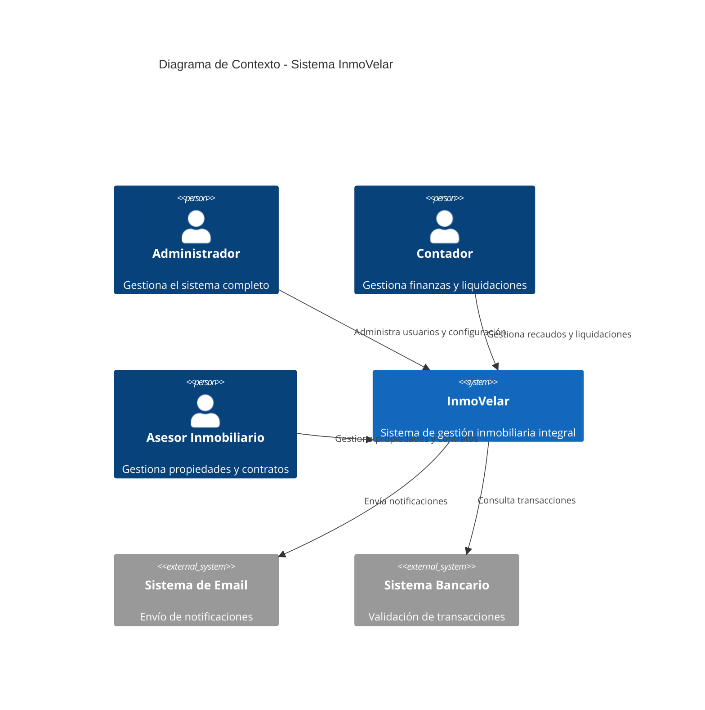

---

## Diagrama C4 - Nivel de Contenedores

El diagrama de contenedores muestra los principales componentes tecnológicos del sistema.

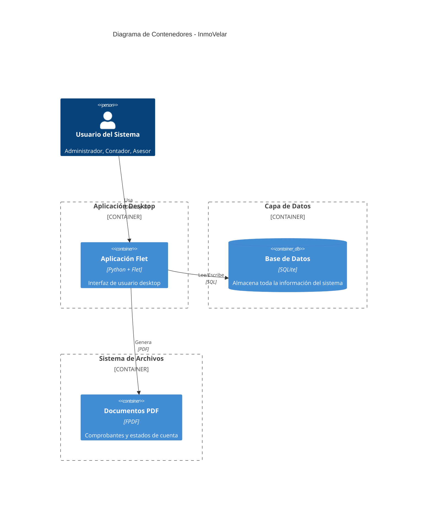

---

## Diagrama C4 - Nivel de Componentes

El diagrama de componentes muestra la arquitectura interna de la aplicación siguiendo Clean Architecture.

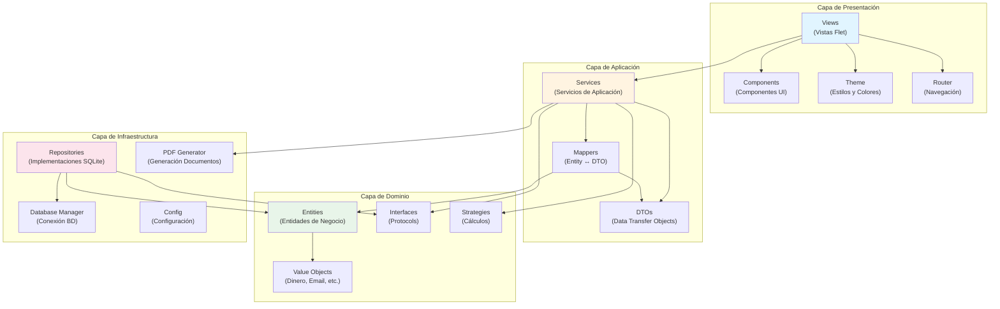

---

## Diagrama de Flujo de Datos

Muestra el flujo completo de datos desde la UI hasta la base de datos.

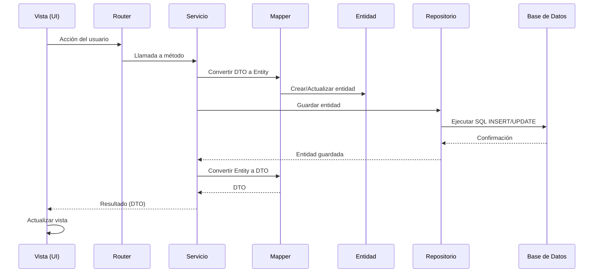

### Flujo de Lectura

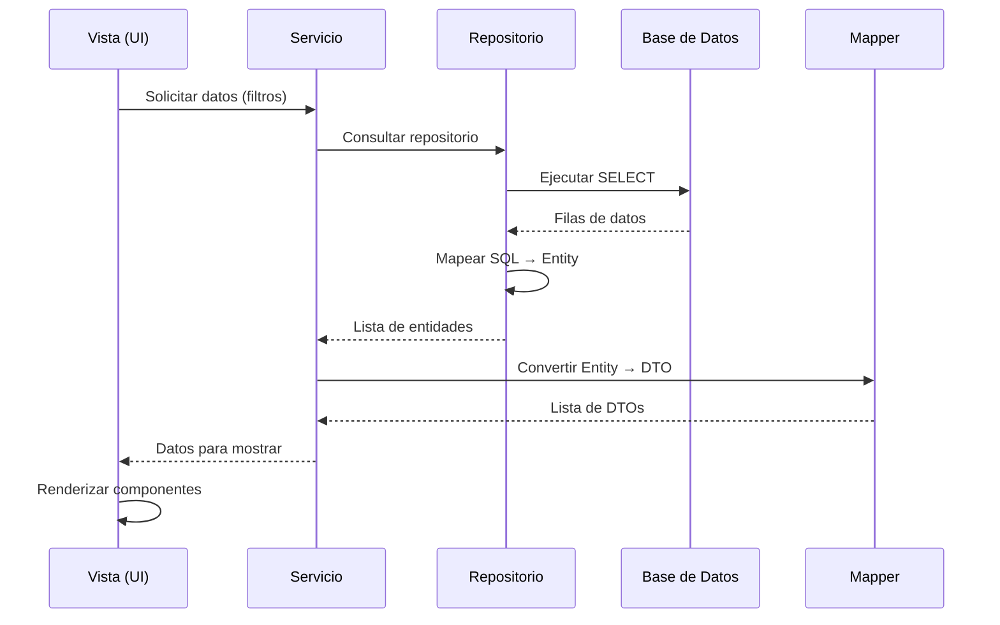

---

## Diagramas de Estados

### Estados de Incidente

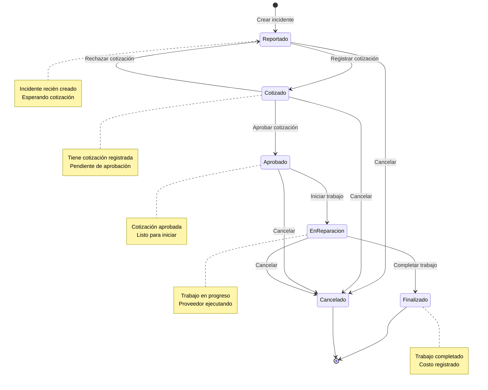

### Estados de Contrato

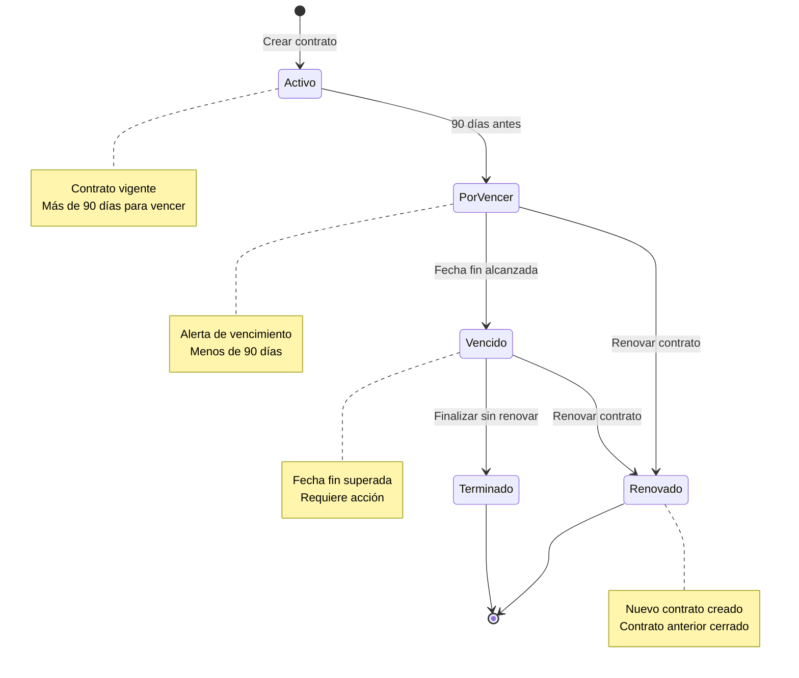

### Estados de Liquidación

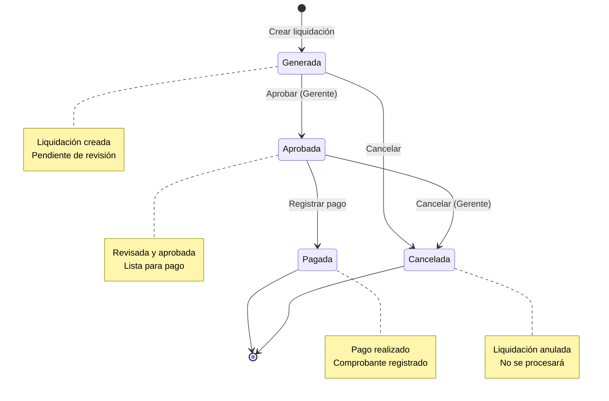

### Estados de Recaudo

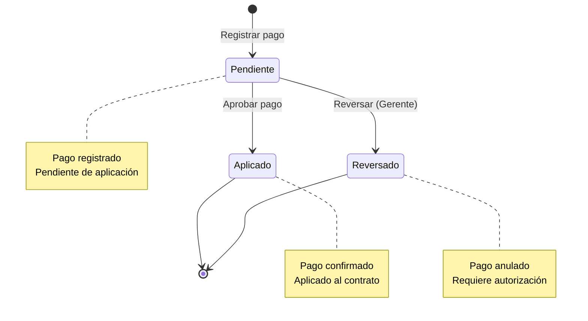

---

## Diagrama ER Simplificado

Muestra las entidades principales y sus relaciones.

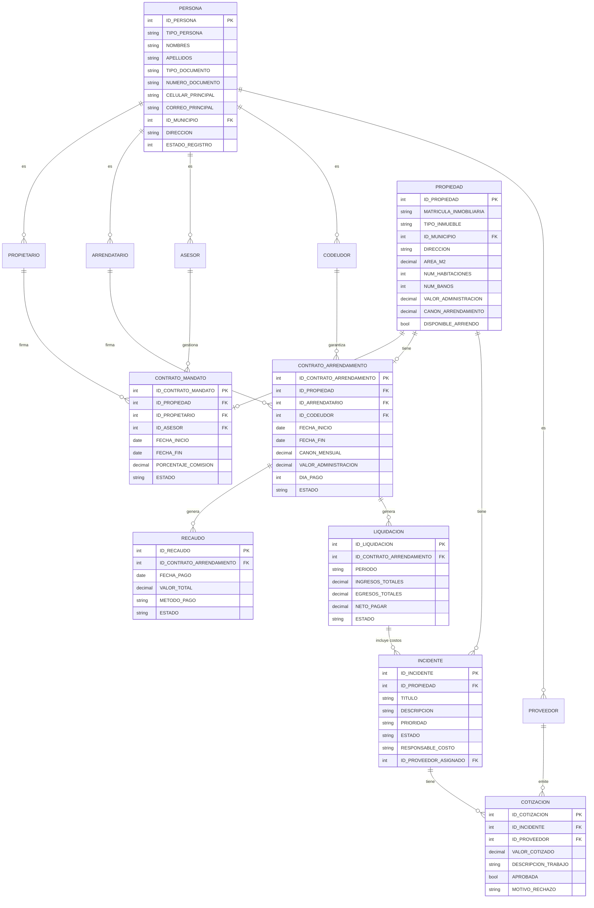

### Relaciones Clave

1. **Party Model**: Una `PERSONA` puede tener múltiples roles simultáneamente
2. **Propiedad-Contratos**: Una propiedad puede tener un mandato y un arrendamiento activos
3. **Contratos-Finanzas**: Los contratos de arrendamiento generan recaudos y liquidaciones
4. **Incidentes-Proveedores**: Los incidentes tienen cotizaciones de proveedores
5. **Liquidaciones-Incidentes**: Los costos de incidentes se cargan a las liquidaciones

---

## Arquitectura de Capas

### Dependencias entre Capas

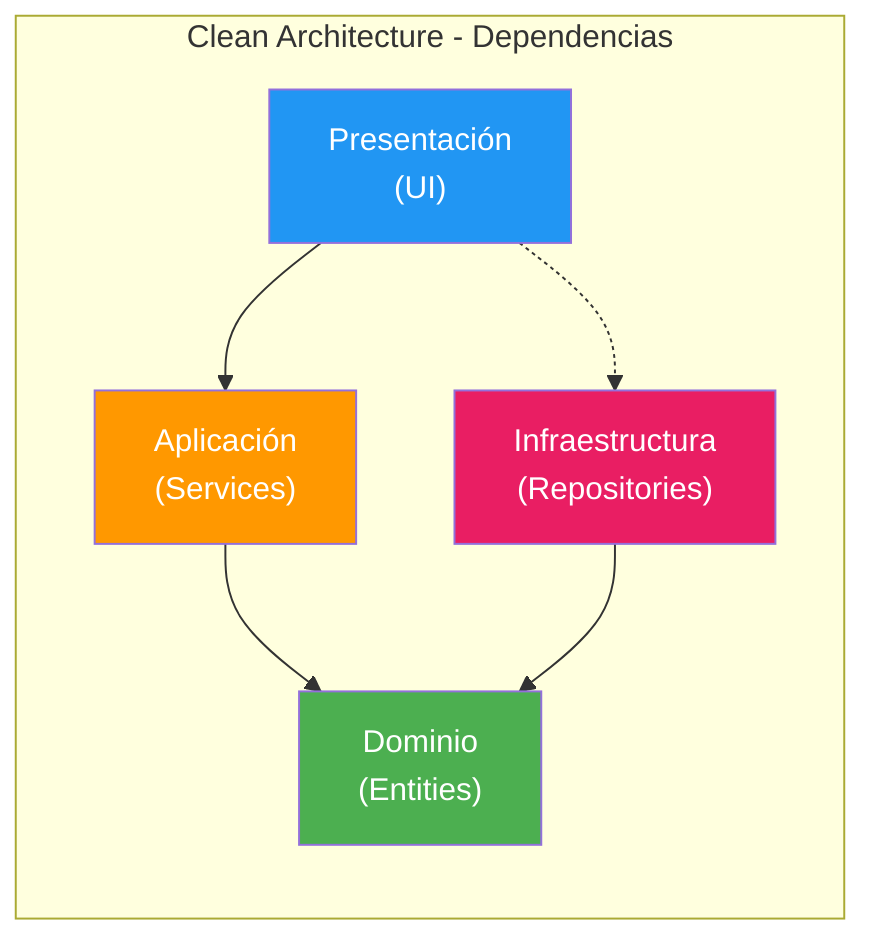

### Reglas de Dependencia

> [!IMPORTANT]
> **Regla de Dependencia**: Las capas externas dependen de las internas, nunca al revés.

- ✅ **Presentación** puede depender de **Aplicación** y **Dominio**
- ✅ **Aplicación** puede depender de **Dominio**
- ✅ **Infraestructura** puede depender de **Dominio**
- ❌ **Dominio** NO puede depender de ninguna otra capa
- ❌ **Aplicación** NO puede depender de **Infraestructura** directamente

---

## Patrones Arquitectónicos Aplicados

### 1. Repository Pattern

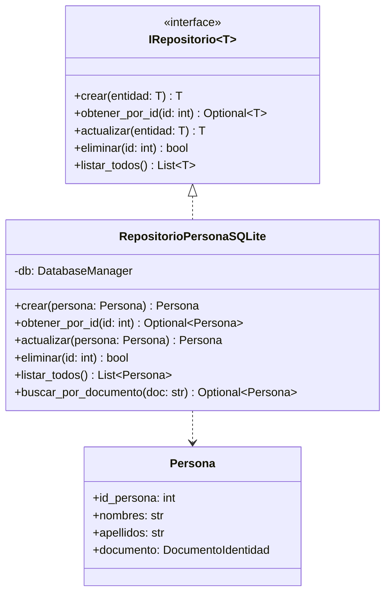

### 2. Service Layer Pattern

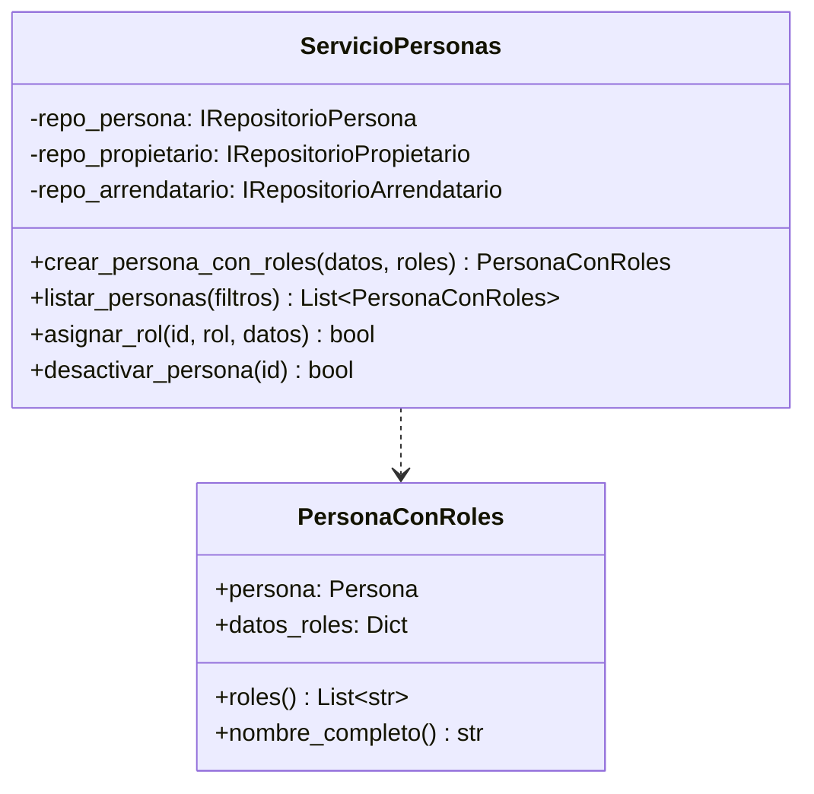

### 3. Strategy Pattern

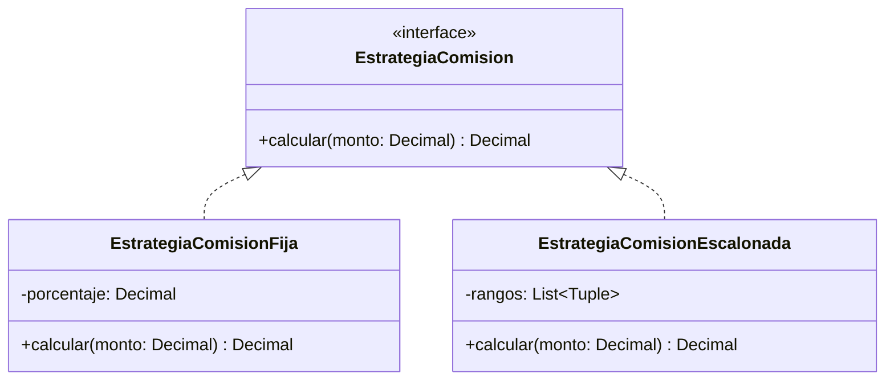

---

## Conclusiones

La arquitectura de InmoVelar está diseñada para:

1. **Mantenibilidad**: Separación clara de responsabilidades
2. **Testabilidad**: Cada capa puede probarse independientemente
3. **Escalabilidad**: Fácil agregar nuevas funcionalidades
4. **Integridad**: La base de datos es la fuente única de verdad
5. **Flexibilidad**: Uso de interfaces y estrategias para extensibilidad

> [!NOTE]
> Esta arquitectura sigue los principios SOLID y Clean Architecture, garantizando un código limpio, mantenible y profesional.

---

**Fin de la Documentación de Arquitectura**

*Última actualización: Diciembre 2025*  
*Versión del Sistema: 1.0*
