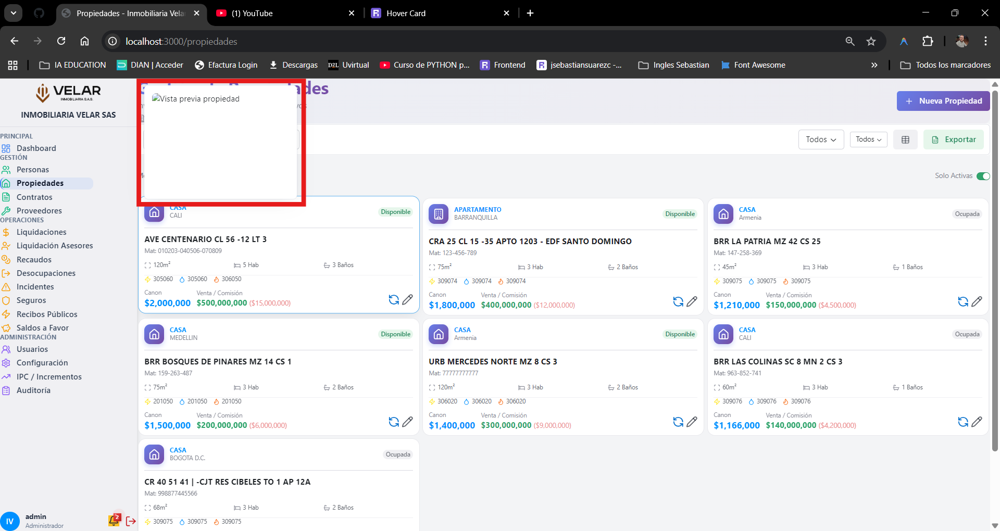

# PROMPT TÉCNICO PARA IMPLEMENTACIÓN DE CARGA DE DOCUMENTOS E IMÁGENES - NIVEL ÉLITE

## 🎯 OBJETIVO

Implementar funcionalidad completa de carga, gestión y visualización de documentos e imágenes a nivel empresarial en los módulos: **Contratos**, **Liquidaciones**, **Liquidación Asesores**, **Recaudos**, **Desocupaciones**, **Incidentes**, y **Recibos Públicos**.

## 🏗️ FASE 1: INFRAESTRUCTURA BASE

- [X] **1.1 Configuración Global**
  - [X] Crear `src/dominio/constantes/tipos_documento.py` con `TIPOS_DOCUMENTO_MODULO` y `DOCUMENTOS_REQUERIDOS_POR_ESTADO`.
- [X] **1.2 Extensión Servicio Documental**
  - [X] Crear/Extender `ServicioDocumentalElite` en `src/aplicacion/servicios/servicio_documental.py`.
    - [X] `validar_documento_modulo`
    - [X] `generar_thumbnail` (PIL)
    - [X] `extraer_texto_ocr` (Placeholder/Tesseract)
    - [X] `comprimir_imagen`
    - [X] `procesar_upload_multiple`
- [X] **1.3 Componentes UI Especializados**
  - [X] Crear `src/presentacion_reflex/components/document_manager_elite.py`.
    - [X] Drag & Drop zone.
    - [X] File preview cards.
    - [X] Progress bars.
  - [X] Crear `src/presentacion_reflex/components/image_gallery.py`.
    - [X] Grid layout.
    - [X] Lightbox support.
- [X] **1.4 Estado Base**
  - [X] Crear Mixin o Clase Base para manejo de documentos en el state.

## 🏗️ FASE 2: INTEGRACIÓN POR MÓDULOS

### 2.1 Contratos

- [X] **Backend (State)**:
  - [X] Actualizar `ContratosState` (variables `documentos_contrato`, `upload_progress`).
  - [X] Implementar `handle_upload_documentos`.
- [X] **Frontend (UI)**:
  - [X] Modificar `contrato_arrendamiento_form.py` y `contrato_mandato_form.py`.
  - [X] Agregar Tab "Documentos".
  - [X] Integrar `document_manager_elite`.

### 2.2 Incidentes

- [X] **Backend**:
  - [X] Heredar `DocumentosStateMixin` en `IncidentesState`.
  - [X] Configurar `current_entidad_tipo = "INCIDENTE"`.
  - [X] Implementar carga de documentos al seleccionar incidente.
- [X] **Frontend**:
  - [X] Modificar `modal_details.py` de Incidentes (Implementar Tabs).
  - [X] Integrar `document_manager_elite` con validación de estado.

### 2.3 Desocupaciones

- [X] **Backend**:
  - [X] Heredar `DocumentosStateMixin` en `DesocupacionesState`.
  - [X] Configurar `current_entidad_tipo = "DESOCUPACION"`.
- [X] **Frontend**:
  - [X] Modificar `checklist_modal.py` (Implementar Tabs).
  - [X] Agregar soporte para checklist y fotos de estado.

### 2.4 Recaudos

- [X] **Backend**:
  - [X] Heredar `DocumentosStateMixin` en `RecaudosState`.
  - [X] Configurar `current_entidad_tipo = "RECAUDO"`.
- [X] **Frontend**:
  - [X] Integrar en modal de detalle (`detail_modal.py`).

### 2.5 Liquidaciones (Propietarios)

- [X] **Backend**:
  - [X] Heredar `DocumentosStateMixin` en `LiquidacionesState`.
  - [X] Configurar `current_entidad_tipo = "LIQUIDACION"`.
- [X] **Frontend**:
  - [X] Integrar en modal de detalle (`liquidacion_detail_modal.py`).

### 2.6 Liquidación Asesores (Nuevo)

- [X] **Backend**:
  - [X] Heredar `DocumentosStateMixin` en `LiquidacionAsesoresState`.
  - [X] Configurar `current_entidad_tipo = "LIQUIDACION_ASESOR"`.
- [X] **Frontend**:
  - [X] Integrar en modal de detalle.

### 2.7 Recibos Públicos (Nuevo)

- [X] **Backend**:
  - [X] Heredar `DocumentosStateMixin` en `RecibosState`.
  - [X] Configurar `current_entidad_tipo = "RECIBO_PUBLICO"`.
- [X] **Frontend**:
  - [X] Integrar en modal de detalle.

## 🏗️ FASE 3: CARACTERÍSTICAS AVANZADAS

- [X] **Validaciones de Negocio**: `ValidadorDocumentos`.
- [X] **Procesamiento Asíncrono**: `ProcesadorDocumentosAsync`.
- [X] **API Documentos**: Endpoints en `documentos_api.py`.

## 🏗️ FASE 4: TESTING & OPTIMIZACIÓN

- [X] Tests de carga de archivos grandes.
- [X] Tests de validación de extensiones/mime-types.
- [X] Verificación de miniaturas.

---

**Registro de Cambios y Progreso**
*Fecha Actualización: 2026-01-24*
*Mensaje: PROYECTO COMPLETADO. Fase 4 terminada exitosamente con script de pruebas automatizadas (`tests/test_documentos_elite.py`) validando reglas de negocio y procesamiento de imágenes.*
