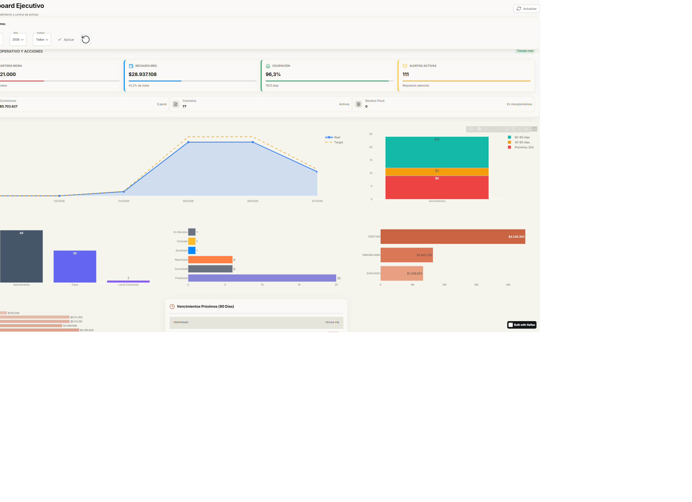
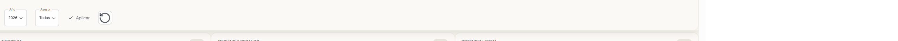
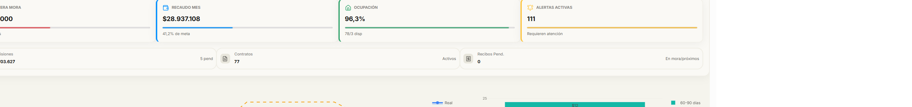
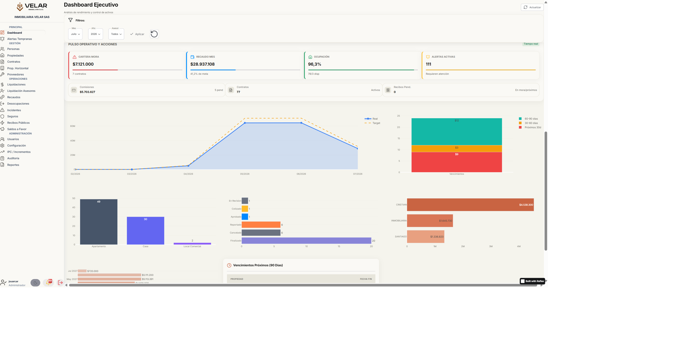
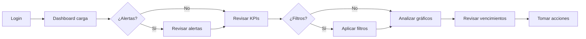
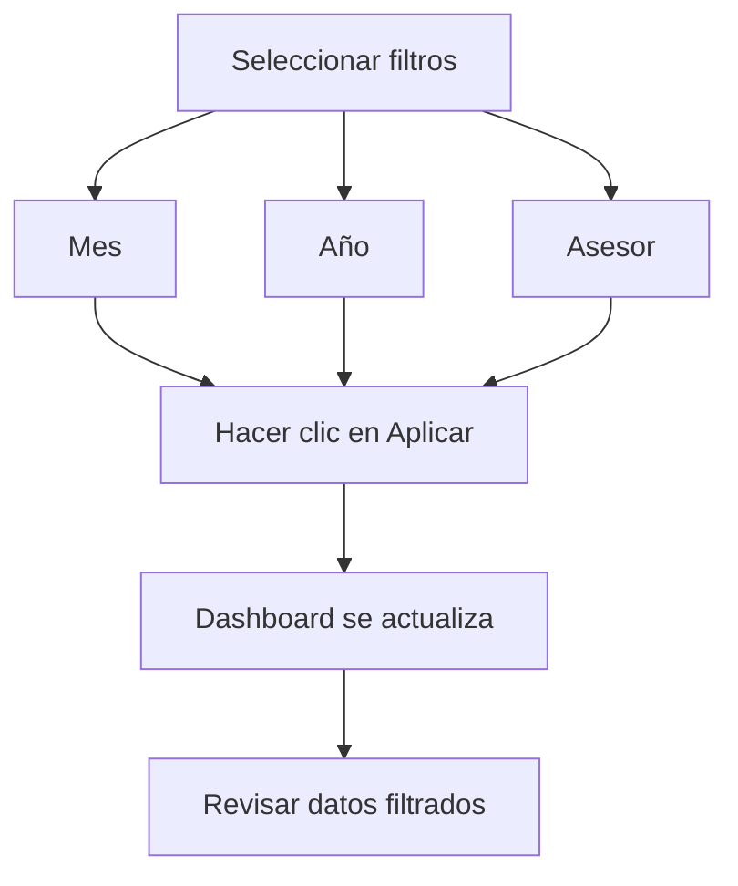
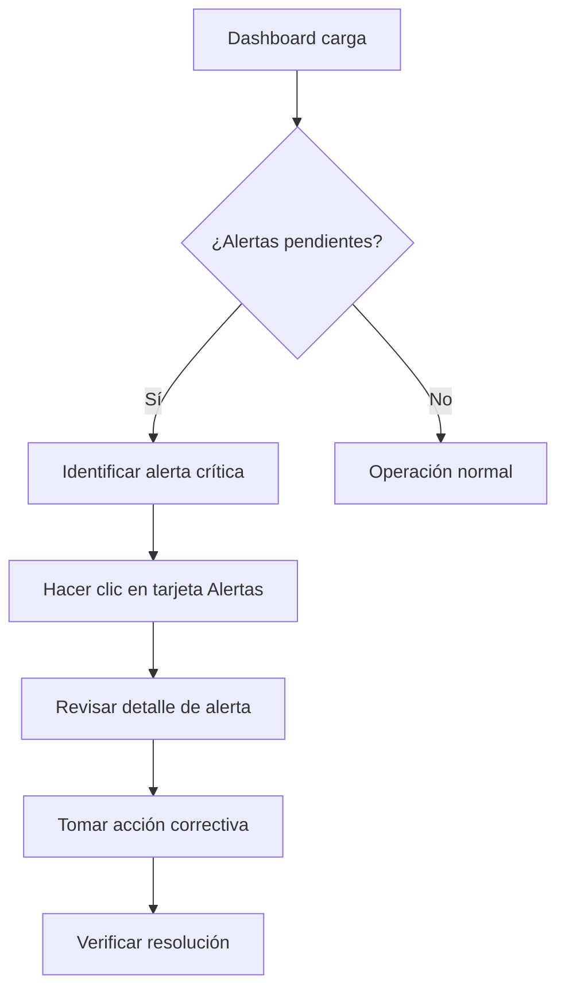
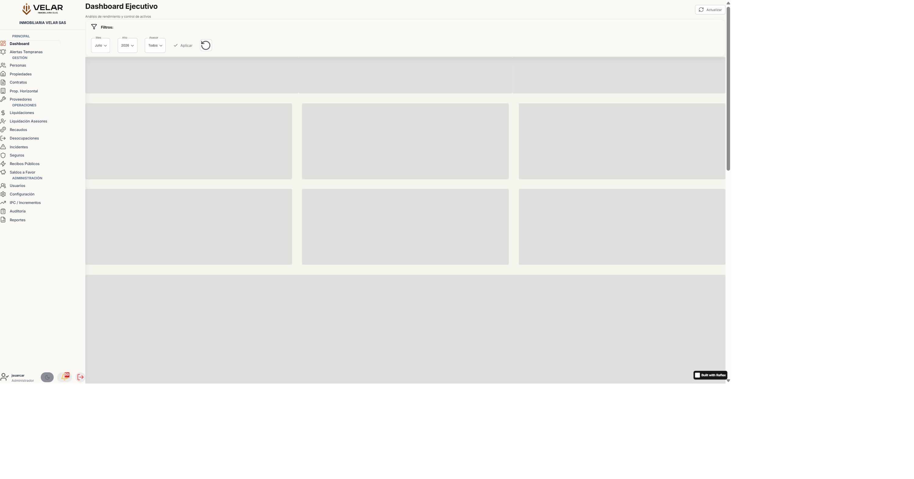

# Dashboard

## 1. Introducción

### Objetivo

El Dashboard es el panel de control ejecutivo del sistema Inmobiliaria Velar, diseñado para proporcionar una vista consolidada y en tiempo real del estado operativo del negocio. Este módulo centraliza las métricas clave, alertas y análisis de rendimiento en una única pantalla, permitiendo a los tomadores de decisiones obtener información crítica de forma inmediata sin necesidad de navegar entre múltiples módulos.

### Alcance

El Dashboard es de acceso general para todos los usuarios autenticados del sistema, independientemente de su rol. Sin embargo, la información mostrada puede variar según los permisos asignados a cada usuario. Los administradores tienen acceso a métricas globales, mientras que los asesores ven datos filtrados por su cartera personal.

### Beneficios

- **Visión 360° en un solo lugar**: Concentra todas las métricas críticas del negocio en una pantalla única, eliminando la necesidad de consultar múltiples reportes
- **Detección temprana de incidencias**: Identifica problemas potenciales antes de que se conviertan en críticos mediante alertas visuales y tendencias
- **Acceso unificado a métricas clave**: Proporciona indicadores de desempeño financieros, operativos y de gestión en tiempo real
- **Toma de decisiones informada**: Facilita la toma de decisiones basada en datos actualizados y precisos
- **Monitoreo continuo**: Permite el seguimiento constante del rendimiento del negocio sin esfuerzo adicional

### Casos de uso

- **Revisión matutina de estado de cartera**: Al inicio de la jornada laboral, revisar el estado general de contratos, pagos y alertas
- **Monitoreo de vencimientos y alertas**: Seguimiento continuo de contratos próximos a vencer y notificaciones pendientes
- **Análisis de rendimiento por asesor**: Evaluación del desempeño individual de cada asesor comercial
- **Seguimiento de metas de recaudo**: Verificación del progreso contra objetivos financieros mensuales
- **Detección de tendencias de mora**: Identificación temprana de problemas de cobro y mora
- **Revisión de distribución de propiedades**: Análisis de la composición del portafolio por tipo de inmueble

---

## 2. Conceptos Básicos

> [!NOTE] Indicador
> Un **indicador** es una métrica cuantificable que resume el estado de un área del negocio. En el Dashboard, los indicadores se presentan como tarjetas con valores numéricos, porcentajes o montos monetarios.

> [!NOTE] KPI (Key Performance Indicator)
> Un **KPI** o Indicador Clave de Desempeño es una métrica estratégica que mide el progreso hacia objetivos específicos del negocio. El Dashboard muestra KPIs financieros, operativos y de gestión.

> [!NOTE] Pulso Operativo
> El **Pulso Operativo** es una sección que muestra el estado actual de las áreas críticas del negocio con indicadores de tendencia y progreso, actualizados en tiempo real.

> [!NOTE] Filtros
> Los **filtros** son controles que permiten personalizar la información mostrada en el Dashboard, seleccionando período temporal (mes y año) y asesor específico.

> [!NOTE] Gráficos
> Los **gráficos** son representaciones visuales de datos que facilitan la identificación de tendencias, distribuciones y comparaciones entre períodos o categorías.

---

## 3. Acceso

### Ruta de acceso

```
Menú principal → Dashboard
```

### Permisos requeridos

- **Rol mínimo**: Usuario (cualquier usuario autenticado)
- **Permiso requerido**: `dashboard:read`
- **Administración de permisos**: Los permisos son asignados por el administrador del sistema desde el módulo de gestión de usuarios

### Ubicación en el sistema

El Dashboard es la **página inicial post-login**. Al autenticarse en el sistema, el usuario es redirigido automáticamente al Dashboard. También puede acceder en cualquier momento desde el menú lateral de navegación.

### Requisitos previos

- Tener credenciales de acceso válidas (usuario y contraseña)
- Contar con permiso `dashboard:read` asignado
- Navegador web actualizado (Chrome, Firefox, Edge, Safari)
- Conexión a internet estable

---

## 4. Interfaz de Usuario

### Estructura general

El Dashboard se organiza en las siguientes secciones principales:

| Sección | Ubicación | Descripción |
|---------|-----------|-------------|
| Header Estratégico | Parte superior | Título del dashboard, subtítulo y botón de actualización |
| Barra de Filtros | Debajo del header | Controles para filtrar datos por mes, año y asesor |
| KPIs Estratégicos | Fila superior | Tarjetas con métricas financieras clave |
| Pulso Operativo | Segunda fila | Indicadores de estado del negocio con tendencias |
| Gráficos de Análisis | Tercera y cuarta filas | Representaciones visuales de datos |
| Tabla de Vencimientos | Quinta fila | Lista consolidada de contratos próximos a vencer |

### Elementos de la interfaz

| Elemento | Descripción | Funcionalidad |
|----------|-------------|---------------|
| **Título "Dashboard Ejecutivo"** | Encabezado principal | Identifica la página actual |
| **Subtítulo** | "Análisis de rendimiento y control de activos" | Describe el propósito del dashboard |
| **Botón "Actualizar"** | Icono de refresh + texto | Recarga todos los datos del dashboard manualmente |
| **Filtros** | Barra de controles | Permite filtrar datos por período y asesor |
| **Tarjetas KPI** | Rectángulos con métricas | Muestran indicadores financieros clave |
| **Indicadores de Pulso** | Tarjetas con badges de tendencia | Muestran estado operativo en tiempo real |
| **Gráficos** | Visualizaciones de datos | Representan tendencias y distribuciones |
| **Tabla de Vencimientos** | Lista de contratos | Detalla contratos próximos a vencer |
| **Menú lateral** | Navegación izquierda | Acceso a otros módulos del sistema |
| **Alertas superiores** | Notificaciones | Indican vencimientos y eventos críticos |

### Diseño responsive

El Dashboard utiliza un diseño adaptativo que se ajusta automáticamente al tamaño de la pantalla:

- **Escritorio (lg)**: Layout completo con 3 columnas para gráficos
- **Tableta (md)**: Layout de 2 columnas para gráficos
- **Móvil (sm)**: Layout de 1 columna, filtros apilados verticalmente


*Figura 1: Vista general del Dashboard mostrando todas las secciones principales*

---

## 5. Funcionalidades

### 5.1 Visualizar Indicadores Generales

**Propósito**: Obtener un snapshot inmediato del estado operativo del negocio.

**Cuándo utilizarla**: Al inicio de la jornada laboral, después de actualizaciones masivas de datos, o cuando se necesita una visión rápida del estado general.

**Procedimiento**:

1. Ingresar al sistema con credenciales válidas
2. El Dashboard carga automáticamente al completar el login
3. Revisar cada tarjeta de indicador en la parte superior
4. Observar los valores numéricos y porcentajes mostrados
5. Verificar las tendencias indicadas (+/- porcentaje)

**Resultado esperado**: Vista consolidada de las métricas financieras principales sin acciones adicionales.

**Indicadores disponibles**:

| Indicador | Descripción | Fórmula |
|-----------|-------------|---------|
| **Ocupación Financiera** | Mide ingresos reales vs capacidad de generación total | Ingresos reales / Potencial total × 100 |
| **Eficiencia Recaudo** | Porcentaje del monto total esperado recaudado este mes | Monto recaudado / Monto esperado × 100 |
| **Potencial Total** | Valor total estimado de contratos activos | Suma de valores de contratos activos |


*Figura 2: Tarjetas KPI mostrando métricas financieras clave*

---

### 5.2 Usar Filtros para Personalizar la Vista

**Propósito**: Customizar los datos mostrados en el Dashboard según criterios específicos de búsqueda.

**Cuándo utilizarla**: Cuando se necesita analizar datos de un período específico, un asesor en particular, o comparar períodos diferentes.

**Procedimiento**:

1. Ubicar la barra de filtros debajo del header del Dashboard
2. Seleccionar el **Mes** deseado usando el dropdown
3. Seleccionar el **Año** deseado usando el dropdown
4. (Opcional) Seleccionar un **Asesor** específico del dropdown
5. Hacer clic en el botón **"Aplicar"** para ejecutar la búsqueda
6. (Opcional) Hacer clic en el botón de **reiniciar** para volver a los valores por defecto

**Resultado esperado**: El Dashboard se actualiza mostrando solo los datos que coinciden con los criterios de filtro seleccionados.

**Detalles de los filtros**:

| Filtro | Opciones | Comportamiento |
|--------|----------|----------------|
| **Mes** | Enero a Diciembre | Por defecto: mes actual |
| **Año** | Últimos 5 años | Por defecto: año actual |
| **Asesor** | Todos + lista de asesores | Por defecto: Todos |


*Figura 3: Barra de filtros con controles de Mes, Año y Asesor*

> [!IMPORTANT] Comportamiento del filtro Asesor
> Cuando selecciona un asesor específico, los gráficos de "Top Asesores" y "Túnel de Vencimientos" se ocultan, ya que muestran información comparativa que no aplica a un solo asesor.

---

### 5.3 Actualizar Datos Manualmente

**Propósito**: Forzar una recarga inmediata de todos los datos del Dashboard.

**Cuándo utilizarla**: Cuando se sospecha que los datos están desactualizados, después de realizar cambios en otros módulos, o cuando se necesita información en tiempo real.

**Procedimiento**:

1. Ubicar el botón **"Actualizar"** en la parte superior derecha del Dashboard
2. Hacer clic en el botón
3. Observar el indicador de carga (skeleton loaders)
4. Esperar a que se complete la actualización

**Resultado esperado**: Todos los datos del Dashboard se actualizan con la información más reciente del sistema.

> [!NOTE] Actualización automática
> El Dashboard también se actualiza automáticamente cada vez que el usuario aplica un filtro. La actualización manual es adicional a esta funcionalidad.

---

### 5.4 Interpretar el Pulso Operativo

**Propósito**: Comprender el estado actual de las áreas críticas del negocio con indicadores de tendencia.

**Cuándo utilizarla**: Para obtener una visión rápida del rendimiento operativo y identificar áreas que requieren atención.

**Componentes del Pulso Operativo**:

| Indicador | Descripción | Color | Significado |
|-----------|-------------|-------|-------------|
| **Cartera Mora** | Monto total en mora y contratos afectados | Rojo | Indica riesgo financiero |
| **Recaudo Mes** | Monto recaudado y porcentaje de meta alcanzada | Azul | Indica cumplimiento de objetivos |
| **Ocupación** | Porcentaje de ocupación y unidades disponibles | Verde | Indica utilización de activos |
| **Alertas Activas** | Número de alertas pendientes de atención | Ámbar | Indica tareas pendientes |

**Cómo interpretar las tendencias**:

- **Barra de progreso**: Muestra el nivel actual vs la meta o capacidad total
- **Color del badge**: Verde (bueno), Rojo (crítico), Ámbar (atención), Azul (informativo)
- **Subtítulo**: Proporciona contexto adicional (ej: "3 contratos", "85% de meta")


*Figura 4: Sección de Pulso Operativo mostrando indicadores en tiempo real*

---

### 5.5 Analizar Gráficos de Tendencias

**Propósito**: Identificar tendencias, distribuciones y comparaciones en los datos del negocio.

**Cuándo utilizarla**: Para análisis profundo de comportamiento temporal, composición del portafolio o rendimiento relativo.

**Gráficos disponibles**:

#### 5.5.1 Evolución del Recaudo (Gráfico de Área)

- **Tipo**: Gráfico de área con línea de tendencia
- **Datos**: Monto recaudado por mes vs línea de target
- **Interpretación**: La línea azul sólida muestra el recaudo real, la línea punteada amarilla muestra el objetivo. El área sombreada indica la magnitud del recaudo.
- **Uso**: Identificar meses con mejor/peor recaudo y comparar contra objetivos


*Figura 5: Gráfico de área mostrando la evolución del recaudo vs target*

#### 5.5.2 Vencimientos por Período (Gráfico de Barras Apiladas)

- **Tipo**: Gráfico de barras apiladas
- **Datos**: Contratos venciendo en 30, 60 y 90 días
- **Colores**: Rojo (30 días - urgente), Amarillo (60 días - alerta), Verde azulado (90 días - planificación)
- **Interpretación**: La altura total indica el volumen total de vencimientos, la distribución de colores muestra la urgencia
- **Uso**: Planificar acciones de renovación según urgencia


*Figura 6: Gráfico de barras apiladas mostrando vencimientos por período*

#### 5.5.3 Propiedades por Tipo (Gráfico de Barras)

- **Tipo**: Gráfico de barras verticales
- **Datos**: Cantidad de propiedades por categoría (Apartamento, Casa, Local, Oficina, etc.)
- **Interpretación**: La altura de cada barra indica la cantidad de propiedades de cada tipo
- **Uso**: Entender la composición del portafolio de propiedades


*Figura 7: Gráfico de barras mostrando distribución de propiedades por tipo*

#### 5.5.4 Incidentes por Estado (Gráfico de Barras Horizontales)

- **Tipo**: Gráfico de barras horizontales
- **Datos**: Cantidad de incidentes por estado (Reportado, Cotizado, Aprobado, En Reparación, Finalizado)
- **Colores**: Cada estado tiene un color distintivo
- **Interpretación**: La longitud de cada barra indica la cantidad de incidentes en cada estado
- **Uso**: Identificar cuellos de botella en el proceso de resolución de incidentes


*Figura 8: Gráfico de barras horizontales mostrando incidentes por estado*

#### 5.5.5 Top Asesores por Ingresos (Gráfico de Barras Horizontales)

- **Tipo**: Gráfico de barras horizontales
- **Datos**: Los 5 asesores con mayor generación de ingresos
- **Colores**: Los 3 primeros en tonos de naranja (ranking), el resto en gris
- **Interpretación**: Los asesores están ordenados de mayor a menor ingreso
- **Uso**: Reconocer alto rendimiento e identificar oportunidades de mejora


*Figura 9: Gráfico mostrando los asesores con mayor generación de ingresos*

> [!NOTE] Filtro de Asesor
> Este gráfico se oculta cuando selecciona un asesor específico en los filtros, ya que la comparación no aplica a un solo individuo.

#### 5.5.6 Túnel de Vencimientos (Gráfico de Barras Horizontales)

- **Tipo**: Gráfico de barras horizontales con degradado de color
- **Datos**: Valor de riesgo por mes de vencimiento
- **Interpretación**: Los meses más cercanos tienen colores más intensos (mayor urgencia)
- **Uso**: Visualizar la concentración de riesgo en el tiempo


*Figura 10: Gráfico mostrando la concentración de vencimientos por mes*

> [!NOTE] Filtro de Asesor
> Este gráfico también se oculta cuando selecciona un asesor específico.

---

### 5.6 Revisar Tabla de Vencimientos Consolidados

**Propósito**: Obtener detalles específicos de contratos próximos a vencer.

**Cuándo utilizarla**: Para identificar contratos específicos que requieren atención, seguimiento o acción inmediata.

**Procedimiento**:

1. Desplazarse hasta la sección de "Gestión de Vencimientos" en la parte inferior del Dashboard
2. Revisar la tabla que muestra los contratos ordenados por fecha de vencimiento
3. Identificar contratos críticos (vencimiento en menos de 30 días)
4. Tomar acciones necesarias según la información mostrada

**Columnas de la tabla**:

| Columna | Descripción | Formato |
|---------|-------------|---------|
| **Contrato** | Número o identificador del contrato | Texto |
| **Inquilino** | Nombre del inquilino asociado | Texto |
| **Propiedad** | Dirección o identificación de la propiedad | Texto |
| **Fecha Vencimiento** | Fecha de vencimiento del contrato | Fecha (DD/MM/YYYY) |
| **Monto** | Valor mensual del contrato | Moneda ($, .) |
| **Días Restantes** | Días hasta el vencimiento | Número |
| **Estado** | Estado actual del contrato | Texto (Activo, Por vencer, Vencido) |

**Ordenamiento**: La tabla se ordena automáticamente por fecha de vencimiento, mostrando primero los contratos más urgentes.


*Figura 11: Tabla de vencimientos mostrando contratos próximos a vencer*

---

### 5.7 Interpretar Indicadores de Mora

**Propósito**: Comprender la situación de cartera morosa y su impacto financiero.

**Cuándo utilizarla**: Para evaluar el riesgo crediticio y tomar decisiones sobre acciones de cobro.

**Datos mostrados**:

| Dato | Descripción | Ubicación |
|------|-------------|-----------|
| **Monto Total en Mora** | Suma de todos los pagos atrasados | Tarjeta de Pulso Operativo |
| **Cantidad de Contratos** | Número de contratos con pagos vencidos | Subtítulo de la tarjeta |
| **Tendencia** | Comparación con período anterior | Barra de progreso |

**Interpretación**:

- Un monto alto en mora indica problemas de liquidez
- Un número creciente de contratos en mora sugiere problemas sistémicos
- La barra de progreso muestra la proporción del total de contratos que está en mora

---

### 5.8 Comprender Métricas de Ocupación

**Propósito**: Evaluar la utilización del portafolio de propiedades.

**Cuándo utilizarla**: Para planificar estrategias de comercialización y identificar oportunidades de mejora.

**Datos mostrados**:

| Dato | Descripción | Fórmula |
|------|-------------|---------|
| **Porcentaje de Ocupación** | Proporción de propiedades ocupadas | Ocupadas / Total × 100 |
| **Propiedades Ocupadas** | Número de unidades con contrato activo | Conteo directo |
| **Propiedades Disponibles** | Número de unidades sin contrato | Total - Ocupadas |

**Interpretación**:

- Ocupación > 90%: Excelente utilización
- Ocupación 70-90%: Utilización aceptable
- Ocupación < 70%: Requiere atención para mejorar comercialización

---

## 6. Flujo Operativo

### Flujo principal de uso



### Flujo de filtros



### Flujo de respuesta a alertas



---

## 7. Reglas de Negocio

> [!IMPORTANT] Refresco automático
> El Dashboard se actualiza automáticamente cada vez que el usuario aplica un filtro. No hay un intervalo de actualización automática programada.

> [!IMPORTANT] Permisos de visualización
> Los usuarios solo pueden ver datos de su propia cartera (asesores) o datos globales (administradores). Esta regla se aplica automáticamente según el rol del usuario.

> [!IMPORTANT] Filtros y gráficos comparativos
> Cuando se selecciona un asesor específico, los gráficos de "Top Asesores" y "Túnel de Vencimientos" se ocultan automáticamente, ya que muestran información comparativa que no aplica a un solo individuo.

> [!IMPORTANT] Datos en tiempo real
> Los datos del Dashboard se obtienen directamente de la base de datos en cada carga. No se utilizan cachés intermedios, garantizando información actualizada.

> [!IMPORTANT] Manejo de errores
> Si ocurre un error al cargar algún componente específico, el Dashboard muestra un mensaje de advertencia pero continúa funcionando con los demás componentes. Los errores se registran para análisis técnico.

### Reglas de cálculo

| Métrica | Regla de cálculo | Actualización |
|---------|------------------|---------------|
| **Ocupación Financiera** | Ingresos reales / Potencial total × 100 | En cada carga |
| **Eficiencia Recaudo** | Monto recaudado / Monto esperado × 100 | En cada carga |
| **Mora** | Suma de pagos vencidos | En cada carga |
| **Alertas** | Contratos con eventos críticos pendientes | En cada carga |

### Reglas de visualización

| Situación | Comportamiento |
|-----------|----------------|
| **Sin datos** | Se muestra mensaje "No hay datos para mostrar" con enlace a Contratos |
| **Error de carga** | Se muestra callout de advertencia con opción de reintento |
| **Carga en progreso** | Se muestran skeleton loaders (placeholders animados) |
| **Datos parcialmente cargados** | Se muestra toast de advertencia indicando métricas fallidas |


*Figura 12: Skeleton loaders mostrándose durante la carga de datos*

---

## 8. Validaciones

### Validaciones de entrada

| Campo | Regla | Mensaje de error |
|-------|-------|------------------|
| **Mes** | Debe ser un mes válido (1-12) | "Mes no válido" |
| **Año** | Debe ser un año válido (últimos 5 años) | "Año no válido" |
| **Asesor** | Debe ser un ID de asesor válido o "todos" | "Asesor no encontrado" |

### Validaciones de datos

| Condición | Comportamiento |
|-----------|----------------|
| **Monto en cero** | Se muestra "$0" o "0%" según el contexto |
| **Sin contratos activos** | Se muestra "0" en contadores |
| **Sin asesores registrados** | El dropdown de asesores muestra solo "Todos" |
| **Fecha fuera de rango** | Se ajusta al rango disponible automáticamente |

### Validaciones de seguridad

| Regla | Descripción |
|-------|-------------|
| **Autenticación requerida** | El usuario debe estar autenticado para acceder al Dashboard |
| **Permisos verificados** | Se valida el permiso `dashboard:read` al cargar la página |
| **Datos filtrados por rol** | Los asesores solo ven datos de su propia cartera |

---

## 9. Casos Prácticos

<details>
<summary>Caso 1: Detección de alerta crítica</summary>

**Contexto**: Al ingresar esta mañana, el Dashboard muestra una alerta en vencimientos.

**Pasos**:

1. Observar la tarjeta "Alertas Activas" con valor 3 en el Pulso Operativo
2. Hacer clic en la tarjeta para ir al módulo de Alertas
3. Revisar el detalle de cada alerta identificada
4. Priorizar alertas por urgencia (menos días restantes)
5. Tomar acciones específicas para cada caso

**Resultado**: Identificación temprana de contratos por vencer en 48 horas, permitiendo acciones preventivas.

**Tiempo estimado**: 5 minutos

</details>

<details>
<summary>Caso 2: Análisis de rendimiento mensual</summary>

**Contexto**: El gerente necesita revisar el rendimiento del mes actual comparedo con el anterior.

**Pasos**:

1. Verificar que los filtros estén en el mes y año actuales
2. Revisar el KPI "Eficiencia Recaudo" para ver el porcentaje alcanzado
3. Observar el gráfico de "Evolución del Recaudo" para identificar tendencias
4. Comparar la línea real (azul) contra la línea de target (amarilla)
5. Revisar el "Pulso Operativo" para métricas adicionales

**Resultado**: Comprensión clara del rendimiento financiero del mes y áreas de mejora.

**Tiempo estimado**: 10 minutos

</details>

<details>
<summary>Caso 3: Planificación de renovaciones de contratos</summary>

**Contexto**: Se necesita planificar las renovaciones de contratos para los próximos 90 días.

**Pasos**:

1. Desplazarse hasta la sección "Gestión de Vencimientos"
2. Revisar el gráfico de "Vencimientos por Período" (barras apiladas)
3. Identificar la distribución de vencimientos por urgencia:
   - Rojo: Vencen en 30 días (acción inmediata)
   - Amarillo: Vencen en 60 días (planificación)
   - Verde: Vencen en 90 días (seguimiento)
4. Revisar la tabla de vencimientos para detalles específicos
5. Priorizar contactos según urgencia

**Resultado**: Plan estructurado de renovaciones con prioridades claras.

**Tiempo estimado**: 15 minutos

</details>

<details>
<summary>Caso 4: Evaluación de rendimiento de asesores</summary>

**Contexto**: Se necesita evaluar el desempeño de los asesores comerciales.

**Pasos**:

1. Verificar que el filtro de asesor esté en "Todos"
2. Revisar el gráfico "Top Asesores por Ingresos"
3. Identificar a los 3 asesores con mayor generación de ingresos
4. Comparar sus resultados contra el promedio
5. Revisar indicadores individuales si es necesario

**Resultado**: Identificación de alto rendimiento y oportunidades de mejora.

**Tiempo estimado**: 10 minutos

</details>

<details>
<summary>Caso 5: Detección de problemas de mora</summary>

**Contexto**: Se sospecha de un aumento en la cartera morosa.

**Pasos**:

1. Revisar el indicador "Cartera Mora" en el Pulso Operativo
2. Verificar el monto total y cantidad de contratos afectados
3. Observar la barra de progreso para entender la proporción
4. Comparar con períodos anteriores (si están disponibles)
5. Tomar acciones de cobro según la gravedad

**Resultado**: Detección temprana de problemas de cobro y acciones preventivas.

**Tiempo estimado**: 5 minutos

</details>

---

## 10. Buenas Prácticas

> [!TIP]
> Revise el Dashboard antes de operar cualquier módulo para priorizar actividades del día.

> [[TIP]
> Utilice los filtros para analizar períodos específicos y comparar resultados.

> [!TIP]
> Revise las alertas pendientes diariamente para evitar que se conviertan en problemas críticos.

> [!TIP]
> Al interpretar gráficos, preste atención a las tendencias (subidas o bajadas) más que a los valores absolutos.

> [!TIP]
> Utilice el botón "Actualizar" cuando sospeche que los datos no están actualizados.

> [!TIP]
> Para análisis profundo, combine la información de múltiples gráficos del Dashboard.

> [!TIP]
> Documente hallazgos importantes para seguimiento futuro.

---

## 11. Preguntas Frecuentes

<details>
<summary>¿Por qué no veo el Dashboard?</summary>

Verifique que su usuario tenga el permiso `dashboard:read` asignado por el administrador. Si el problema persiste, contacte al soporte técnico.

**Causas comunes**:
- Permiso no asignado
- Sesión expirada
- Problemas de conexión a internet

**Solución**: Cierre sesión y vuelva a iniciar. Si el problema persiste, solicite al administrador que verifique sus permisos.

</details>

<details>
<summary>¿Por qué los datos no se actualizan?</summary>

El Dashboard se actualiza al aplicar filtros o al hacer clic en "Actualizar". Si los datos parecen desactualizados:

**Pasos de solución**:
1. Hacer clic en el botón "Actualizar"
2. Verificar su conexión a internet
3. Si el problema persiste, contacte al soporte técnico

**Nota**: Los datos se obtienen directamente de la base de datos en cada carga, por lo que siempre deben estar actualizados.

</details>

<details>
<summary>¿Puedo ver datos de otros asesores?</summary>

Depende de su rol en el sistema:

- **Administradores**: Pueden ver datos globales de todos los asesores
- **Asesores**: Solo pueden ver datos de su propia cartera

Si necesita acceso a datos de otros asesores, solicite al administrador que ajuste sus permisos.

</details>

<details>
<summary>¿Por qué algunos gráficos no aparecen?</summary>

Algunos gráficos se ocultan automáticamente según los filtros aplicados:

- **Top Asesores**: Se oculta cuando selecciona un asesor específico
- **Túnel de Vencimientos**: Se oculta cuando selecciona un asesor específico

Esto es normal y esperado, ya que estos gráficos muestran información comparativa que no aplica a un solo individuo.

</details>

<details>
<summary>¿Cómo puedo exportar los datos del Dashboard?</summary>

Actualmente, el Dashboard no ofrece una función de exportación directa. Sin embargo, puede:

1. Tomar capturas de pantalla de los gráficos
2. Copiar los datos de las tablas manualmente
3. Solicitar al administrador la generación de reportes personalizados

**Futura funcionalidad**: Se está considerando agregar opciones de exportación en próximas versiones.

</details>

---

## 12. Solución de Problemas

| Síntoma | Causa probable | Solución |
|---------|----------------|----------|
| **Dashboard vacío** | Permisos insuficientes | Verificar permiso `dashboard:read` con el administrador |
| **Indicadores desactualizados** | Caché del navegador | Limpiar caché del navegador o usar modo incógnito |
| **Gráficos no cargan** | Error de conexión | Verificar conexión a internet y recargar la página |
| **Filtros no funcionan** | Error de selección | Seleccionar opciones válidas y hacer clic en "Aplicar" |
| **Mensaje de error rojo** | Error de carga parcial | Hacer clic en "Actualizar" para reintentar la carga |
| **Skeleton loaders visibles** | Carga en progreso | Esperar a que se complete la carga (1-3 segundos) |
| **Sin datos en tabla** | No hay vencimientos | Verificar filtros o consultar el módulo de Contratos |
| **Alertas no aparecen** | No hay alertas pendientes | Verificar módulo de Alertas para más detalles |
| **Rendimiento lento** | Conexión lenta | Verificar velocidad de internet o contactar soporte |
| **Diseño incorrecto** | Navegador obsoleto | Actualizar a la versión más reciente del navegador |

---

## 13. Glosario

| Término | Definición |
|---------|------------|
| **Dashboard** | Panel de control ejecutivo que muestra métricas clave del negocio |
| **KPI** | Indicador Clave de Desempeño (Key Performance Indicator) |
| **Mora** | Situación de pago atrasado en contratos de arrendamiento |
| **Ocupación** | Proporción de propiedades con contrato activo vs total |
| **Recaudo** | Monto efectivamente cobrado vs monto esperado |
| **Vencimiento** | Fecha de finalización de un contrato de arrendamiento |
| **Alerta** | Notificación del sistema que requiere atención del usuario |
| **Pulso Operativo** | Sección del Dashboard que muestra estado en tiempo real |
| **Skeleton Loader** | Placeholder animado que se muestra durante la carga de datos |
| **Filtro** | Control que permite personalizar la información mostrada |

---

## 14. Referencias

- **Manual de Usuario General**: [Enlace al manual principal]
- **Módulo de Contratos**: [Enlace al módulo de contratos]
- **Módulo de Alertas**: [Enlace al módulo de alertas]
- **Guía de Permisos**: [Enlace a la guía de administración]
- **Soporte Técnico**: [Contacto del equipo de soporte]

---

## 15. Registro de Cambios

| Versión | Fecha | Autor | Descripción |
|---------|-------|-------|-------------|
| 1.0 | 2026-07-08 | Documentación Velar | Creación inicial del manual |

---

> [!NOTE] Documentación en mantenimiento
> Este manual se actualiza periódicamente para reflejar cambios en el sistema. Si encuentra información desactualizada, por favor contacte al equipo de documentación.