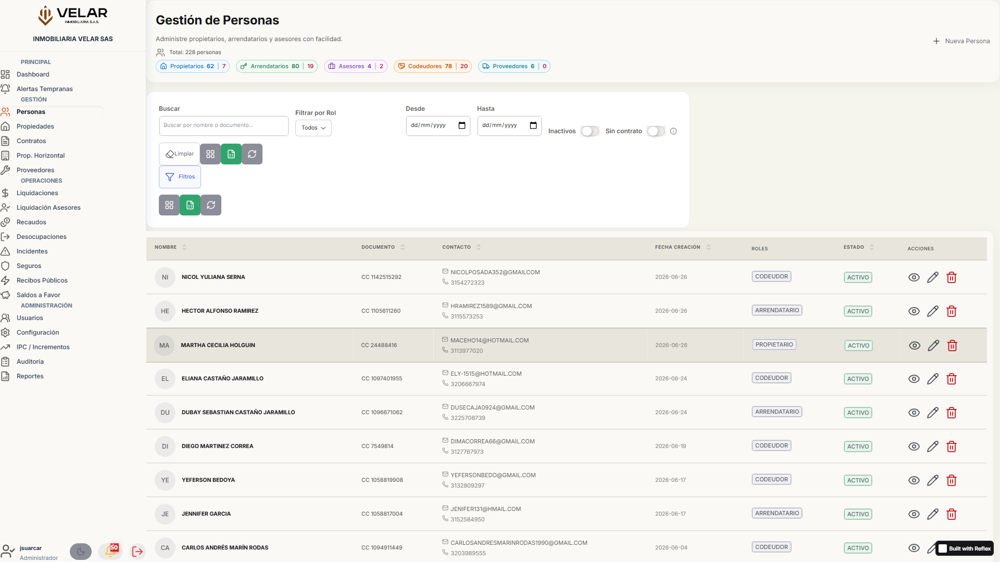
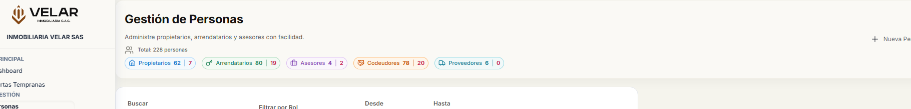
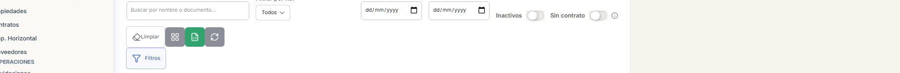
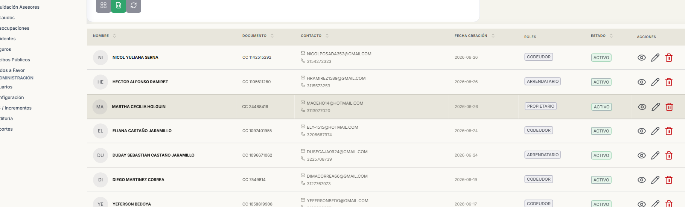
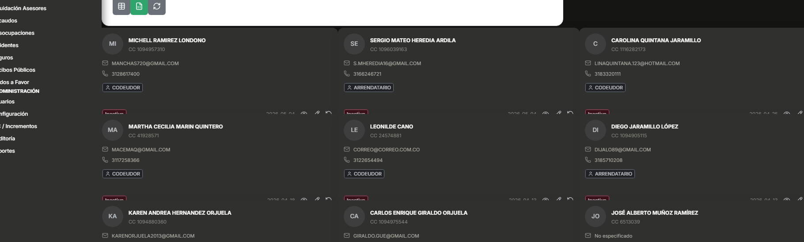
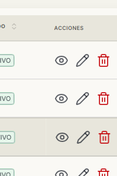
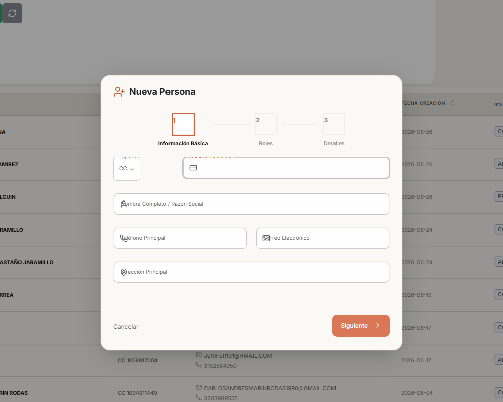
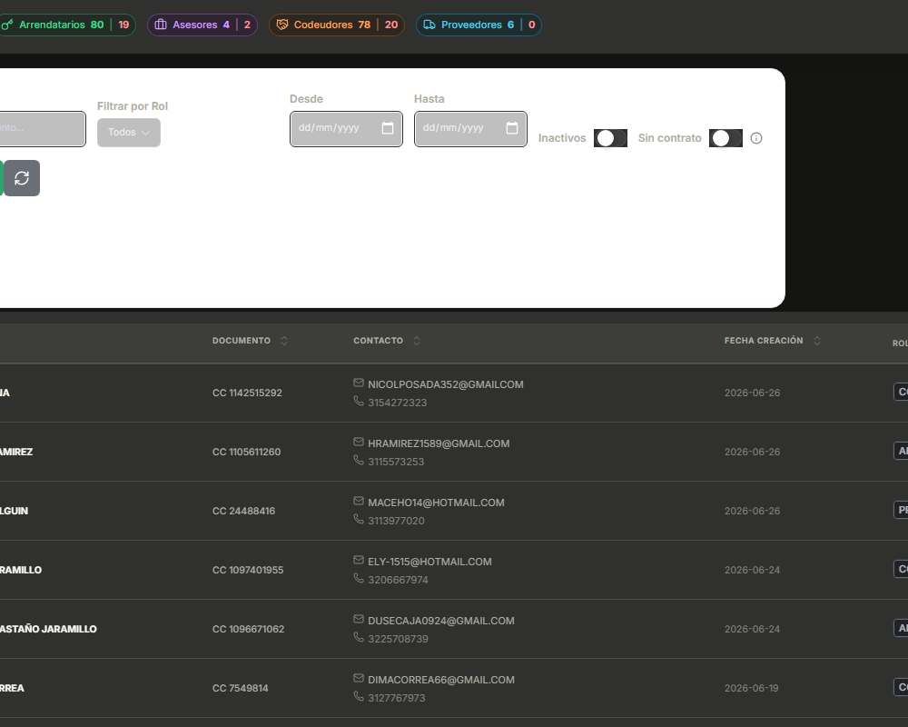
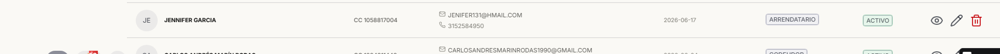
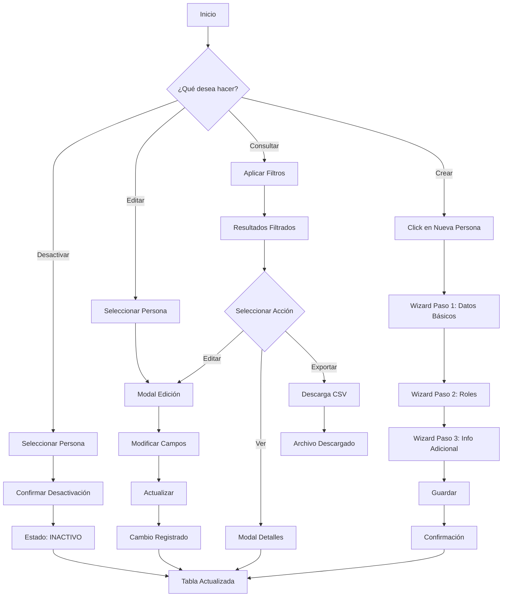

# Módulo Personas

> [!INFO]
> **Módulo de Gestión Integral de Personas**
> Administre propietarios, arrendatarios, asesores, codeudores y proveedores desde un único punto de control centralizado.

---

## 1. Descripción General

El módulo **Personas** es el corazón de la gestión de actores del ecosistema inmobiliario de Inmobiliaria Velar. Permite registrar, consultar, editar y gestionar todas las personas que interactúan con la organización, incluyendo propietarios de inmuebles, arrendatarios, asesores comerciales, codeudores y proveedores de servicios.

### 1.1. Objetivo del Módulo

- **Centralizar** la información de todas las personas asociadas al negocio inmobiliario.
- **Gestionar** múltiples roles por persona (una persona puede ser propietario y arrendatario simultáneamente).
- **Controlar** el acceso y las operaciones mediante permisos basados en roles (RBAC).
- **Mantener** trazabilidad completa de todas las operaciones realizadas.

### 1.2. Beneficios Clave

| Beneficio | Descripción |
|-----------|-------------|
| **Visibilidad 360°** | Vista completa de cada persona con todos sus roles y relaciones |
| **KPIs en Tiempo Real** | Indicadores automáticos de conteo por rol y estado |
| **Búsqueda Avanzada** | Filtros por rol, fecha, estado y texto libre |
| **Exportación** | Descarga de datos filtrados en formato Excel/CSV |
| **Auditoría** | Registro automático de todas las operaciones |
| **Control de Acceso** | Permisos granulares por acción (crear, editar, eliminar) |

---

## 2. Acceso al Módulo

### 2.1. Ruta de Acceso

```
Menú Principal → Personas
```

**URL directa**: `https://inmovelar-production.up.railway.app/personas`

### 2.2. Permisos Requeridos

| Rol | Acciones Permitidas |
|-----|---------------------|
| **Administrador** | Crear, Editar, Eliminar, Ver Detalles, Exportar |
| **Operador** | Crear, Editar, Ver Detalles, Exportar |
| **Auditor** | Ver Detalles, Exportar (solo lectura) |

> [!WARNING]
> Si no tiene los permisos necesarios, los botones de acción no estarán visibles en la interfaz.

---

## 3. Interfaz de Usuario

### 3.1. Estructura General

La pantalla del módulo Personas se compone de las siguientes secciones principales:



```
┌─────────────────────────────────────────────────────────────┐
│  ENCABEZADO                                                │
│  Título: "Gestión de Personas"                             │
│  Subtítulo + Contador Total + KPIs por Rol                 │
│  Botón: [Nueva Persona]                                    │
├─────────────────────────────────────────────────────────────┤
│  BARRA DE FILTROS AVANZADOS                                │
│  [Rol ▼] [Desde] [Hasta] [Inactivos ○] [Sin Contrato ○]  │
│  [🔍 Buscar...] [🔄 Recargar] [📊 Exportar] [⊞/☰ Vista]  │
├─────────────────────────────────────────────────────────────┤
│  CONTENIDO PRINCIPAL                                       │
│  ┌─────────────────────────────────────────────────────┐   │
│  │  TABLA / CARDS (según modo seleccionado)            │   │
│  └─────────────────────────────────────────────────────┘   │
├─────────────────────────────────────────────────────────────┤
│  PAGINACIÓN                                                │
│  [← Anterior]  Página X de Y  [Siguiente →]               │
└─────────────────────────────────────────────────────────────┘
```

### 3.2. Encabezado

El encabezado contiene:

- **Título principal**: "Gestión de Personas"
- **Subtítulo descriptivo**: "Administre propietarios, arrendatarios y asesores con facilidad."
- **Contador total**: Muestra el número total de personas registradas
- **KPIs por rol**: Badges con conteos de activos e inactivos para cada rol

#### Indicadores KPI (Key Performance Indicators)



| KPI | Icono | Color | Descripción |
|-----|-------|-------|-------------|
| **Propietarios** | 🏠 | Azul | Personas que poseen inmuebles |
| **Arrendatarios** | 🔑 | Verde | Personas que alquilan inmuebles |
| **Asesores** | 💼 | Violeta | Asesores comerciales |
| **Codeudores** | 🤝 | Naranja | Garantes de contratos |
| **Proveedores** | 🚛 | Cyan | proveedores de servicios |

Cada KPI muestra el formato: `Activos | Inactivos`

> [!TIP]
> Los KPIs se actualizan automáticamente al cambiar los filtros, proporcionando una vista dinámica de los datos.

### 3.3. Botón "Nueva Persona"

Ubicado en la esquina superior derecha del encabezado.

- **Icono**: `+` (plus)
- **Color**: Terracota (color de marca)
- **Acción**: Abre el modal de creación con wizard de 3 pasos
- **Permisos**: Requiere rol con acción "CREAR" habilitada

---

## 4. Barra de Filtros Avanzados

La barra de filtros permite refinar la búsqueda de personas de múltiples maneras.



### 4.1. Componentes de Filtro

| Componente | Tipo | Descripción |
|------------|------|-------------|
| **Filtrar por Rol** | Select | Todos, Propietario, Arrendatario, Codeudor, Asesor, Proveedor |
| **Desde** | Date Input | Fecha de inicio del rango de creación |
| **Hasta** | Date Input | Fecha de fin del rango de creación |
| **Inactivos** | Toggle Switch | Muestra/oculta personas inactivas |
| **Sin Contrato** | Toggle Switch | Filtra personas sin contrato asociado |
| **Barra de Búsqueda** | Text Input | Búsqueda por nombre o número de documento |

### 4.2. Botones de Acción

| Botón | Icono | Función |
|-------|-------|---------|
| **Cambiar Vista** | ⊞ / ☰ | Alterna entre vista de tabla y cards |
| **Exportar** | 📊 | Descarga los datos filtrados a CSV |
| **Recargar** | 🔄 | Actualiza los datos desde el servidor |

### 4.3. Comportamiento de Búsqueda

1. **Búsqueda en tiempo real**: Al escribir en la barra de búsqueda, los resultados se filtran automáticamente.
2. **Búsqueda por Enter**: También puede presionar `Enter` para ejecutar la búsqueda.
3. **Contador de filtros activos**: Se muestra un indicador con el número de filtros aplicados.

> [!NOTE]
> La búsqueda se realiza por nombre O número de documento. El sistema es case-insensitive (no distingue mayúsculas/minúsculas).

---

## 5. Modos de Visualización

### 5.1. Vista de Tabla (Por Defecto)

La vista de tabla muestra la información en formato de fila con las siguientes columnas:



| Columna | Descripción | Ordenable |
|---------|-------------|-----------|
| **Nombre** | Nombre completo de la persona con avatar | Sí |
| **Documento** | Tipo y número de documento | Sí |
| **Contacto** | Correo electrónico y teléfono | No |
| **Fecha Creación** | Fecha de registro en el sistema | Sí |
| **Roles** | Badges con los roles asignados | No |
| **Estado** | ACTIVO o INACTIVO | Sí |
| **Acciones** | Botones de ver, editar, eliminar/reactivar | No |

#### Características de la Tabla

- **Ordenamiento**: Haga clic en los encabezados de columna para ordenar ascendentemente/descendentemente
- **Hover**: Al pasar el mouse sobre una fila, se resalta suavemente
- **Transiciones**: Cambios de estado con animaciones suaves (0.2s ease)
- **Responsiva**: En dispositivos móviles, la tabla permite scroll horizontal

### 5.2. Vista de Cards

La vista de cards muestra cada persona como una tarjeta visual en un grid responsivo.



- **Grid**: 1 columna (móvil), 2 columnas (tablet), 3 columnas (desktop)
- **Contenido**: Avatar, nombre, documento, contacto, roles, estado
- **Acciones**: Mismos botones que la vista de tabla

> [!TIP]
> Use la vista de cards cuando necesite una visualización más visual y menos densa de la información.

---

## 6. Tabla de Datos - Detalles

### 6.1. Columna Nombre

- Muestra un **avatar** con las iniciales del nombre
- El color del avatar depende del **primer rol** asignado:
  - Propietario: Azul
  - Arrendatario: Verde
  - Asesor: Violeta
  - Codeudor: Naranja
  - Proveedor: Cyan
- El nombre se muestra en **negrita**

### 6.2. Columna Documento

- Formato: `TipoDocumento NúmeroDocumento`
- Ejemplo: `CC 1234567890`
- Tipos de documento soportados: Cédula de Ciudadanía (CC), Tarjeta de Identidad (TI), NIT, etc.

### 6.3. Columna Contacto

Muestra dos líneas:
1. **Correo electrónico** (con icono de email)
2. **Teléfono** (con icono de teléfono, en color gris)

### 6.4. Columna Roles

- Muestra badges con colores específicos para cada rol:
  - **Propietario**: Azul
  - **Arrendatario**: Verde
  - **Asesor**: Violeta
  - **Codeudor**: Naranja
  - **Proveedor**: Cyan
- Una persona puede tener múltiples roles simultáneamente

### 6.5. Columna Estado

- **ACTIVO**: Badge verde
- **INACTIVO**: Badge rojo

### 6.6. Columna Acciones



| Botón | Icono | Condición | Acción |
|-------|-------|-----------|--------|
| **Ver Detalles** | 👁️ | Siempre visible | Abre modal con información completa |
| **Editar** | ✏️ | Solo con permiso EDITAR | Abre modal de edición |
| **Desactivar** | 🗑️ | Solo con permiso ELIMINAR + estado ACTIVO | Cambia estado a INACTIVO |
| **Reactivar** | 🔄 | Solo con permiso ELIMINAR + estado INACTIVO | Cambia estado a ACTIVO |

---

## 7. Funcionalidades Principales

### 7.1. Crear Nueva Persona

**Objetivo**: Registrar una nueva persona en el sistema.

**Procedimiento**:

1. Haga clic en el botón **"Nueva Persona"** en el encabezado.
2. Se abrirá un modal con un **wizard de 3 pasos**:

#### Paso 1: Datos Básicos

| Campo | Obligatorio | Descripción |
|-------|-------------|-------------|
| Nombre Completo | Sí | Nombre y apellidos de la persona |
| Tipo de Documento | Sí | Seleccione el tipo (CC, TI, NIT, etc.) |
| Número de Documento | Sí | Número único de identificación |
| Correo Electrónico | Sí | Dirección de correo válida |
| Teléfono | No | Número de contacto |
| Dirección | No | Dirección de residencia |

3. Complete los campos obligatorios y haga clic en **"Siguiente"**.

#### Paso 2: Asignación de Roles



- Seleccione uno o múltiples roles haciendo clic en cada uno:
  - **Propietario**: Posee inmuebles
  - **Arrendatario**: Alquila inmuebles
  - **Asesor**: Asesor comercial
  - **Codeudor**: Garante de contratos
  - **Proveedor**: Proveedor de servicios

4. Los roles seleccionados se resaltan visualmente.
5. Haga clic en **"Siguiente"**.

#### Paso 3: Información Adicional

- Complete campos adicionales según los roles seleccionados.
- Revise la información antes de guardar.
- Haga clic en **"Guardar"**.

**Resultado esperado**:

- El sistema muestra un mensaje de confirmación: "Persona creada exitosamente"
- La nueva persona aparece en la tabla
- Los KPIs se actualizan automáticamente

> [!IMPORTANT]
> El número de documento debe ser único en el sistema. Si intenta crear una persona con un documento existente, recibirá un error de validación.

### 7.2. Editar Persona

**Objetivo**: Modificar la información de una persona existente.

**Procedimiento**:

1. Localice la persona en la tabla.
2. Haga clic en el icono **✏️ (Editar)** en la columna de acciones.
3. Se abrirá el modal de edición con los datos actuales.
4. Modifique los campos necesarios.
5. Haga clic en **"Actualizar"**.

**Resultado esperado**:

- Los cambios se guardan inmediatamente
- Se registra en el log de auditoría
- La tabla se actualiza con la nueva información

> [!WARNING]
> Algunos campos pueden estar restringidos según el estado de la persona o roles asignados.

### 7.3. Ver Detalles de Persona

**Objetivo**: Consultar la información completa de una persona.

**Procedimiento**:

1. Localice la persona en la tabla.
2. Haga clic en el icono **👁️ (Ver Detalles)** en la columna de acciones.
3. Se abrirá un modal con información detallada:

#### Información del Modal de Detalles



| Sección | Contenido |
|---------|-----------|
| **Datos Personales** | Nombre, documento, correo, teléfono, dirección, fecha de creación |
| **Roles Asignados** | Lista de roles con información específica de cada uno |
| **Propiedades** (si es Propietario) | Lista de propiedades asociadas |
| **Contratos** (si es Arrendatario) | Contratos activos e históricos |
| **Garantías** (si es Codeudor) | Garantías activas |
| **Historial de Auditoría** | Registro de cambios realizados con fechas y usuarios |

4. Para cerrar, haga clic fuera del modal o en el botón de cerrar.

### 7.4. Desactivar/Reactivar Persona

**Objetivo**: Cambiar el estado operativo de una persona.

#### Desactivar Persona

1. Asegúrese de que la persona esté en estado **ACTIVO**.
2. Haga clic en el icono **🗑️ (Desactivar)**.
3. Confirme la acción si se solicita.

**Resultado**: La persona cambia a estado **INACTIVO** y no aparecerá en las búsquedas predeterminadas.

#### Reactivar Persona

1. Active el filtro **"Mostrar Inactivos"** en la barra de filtros.
2. Localice la persona inactiva.
3. Haga clic en el icono **🔄 (Reactivar)**.

**Resultado**: La persona vuelve a estado **ACTIVO**.

> [!NOTE]
> Este es un "soft delete" - la persona no se elimina físicamente del sistema, solo cambia su estado. Esto preserva la integridad referencial de los datos.

### 7.5. Exportar Datos

**Objetivo**: Descargar los datos filtrados en formato CSV para análisis externo.

**Procedimiento**:

1. Aplique los filtros deseados (rol, fechas, búsqueda, etc.).
2. Haga clic en el botón **📊 (Exportar)** en la barra de herramientas.
3. El sistema generará un archivo CSV con los datos filtrados.
4. Se descargará automáticamente un archivo llamado `personas_export_[timestamp].csv`.

**Contenido del archivo exportado**:

- Todos los campos visibles en la tabla
- Datos en formato UTF-8 con BOM para compatibilidad con Excel
- Solo incluye personas que cumplan con los filtros activos

> [!TIP]
> Para exportar todos los datos, asegúrese de que no haya filtros activos antes de hacer clic en exportar.

---

## 8. Paginación

La paginación permite navegar entre conjuntos de datos cuando hay muchas personas registradas.



### 8.1. Componentes de Paginación

| Elemento | Descripción |
|----------|-------------|
| **Botón "Anterior"** | Navega a la página anterior (deshabilitado en página 1) |
| **Indicador** | Muestra "Página X de Y" |
| **Info** | Muestra "Mostrando X-Y de Z personas" |
| **Botón "Siguiente"** | Navega a la página siguiente (deshabilitado en última página) |

### 8.2. Comportamiento

- **Registros por página**: 10 personas (configurable)
- **Reset automático**: Al cambiar filtros, la paginación vuelve a la página 1
- **Navegación**: Se puede usar teclado (flechas) o ratón

---

## 9. Reglas de Negocio

### 9.1. Roles y Permisos

| Permiso | Administrador | Operador | Auditor |
|---------|:------------:|:--------:|:-------:|
| Crear Persona | ✅ | ✅ | ❌ |
| Editar Persona | ✅ | ✅ | ❌ |
| Eliminar/Desactivar | ✅ | ❌ | ❌ |
| Ver Detalles | ✅ | ✅ | ✅ |
| Exportar | ✅ | ✅ | ✅ |

### 9.2. Estados de Persona

- **ACTIVO**: La persona está operando normalmente en el sistema.
- **INACTIVO**: La persona ha sido desactivada (soft delete). No aparece en búsquedas predeterminadas.

### 9.3. Múltiples Roles

Una persona puede tener **uno o más roles** simultáneamente. Ejemplos:
- Una persona puede ser **Propietario** y **Arrendatario** (posee un inmueble y alquila otro).
- Una persona puede ser **Asesor** y **Proveedor** (brinda servicios de asesoría y suministros).

### 9.4. Integridad Referencial

- **No eliminación física**: Las personas nunca se eliminan físicamente de la base de datos.
- **Soft delete**: Solo se cambia el estado a INACTIVO.
- **Trazabilidad**: Todas las operaciones se registran en el log de auditoría.

### 9.5. Validaciones

| Campo | Regla de Validación | Mensaje de Error |
|-------|---------------------|------------------|
| Nombre | Obligatorio, mínimo 2 caracteres | "El nombre es obligatorio" |
| Documento | Obligatorio, único en el sistema | "Este documento ya está registrado" |
| Correo | Formato válido de email | "Ingrese un correo electrónico válido" |
| Roles | Al menos un rol seleccionado | "Debe seleccionar al menos un rol" |

---

## 10. Flujo de Trabajo



---

## 11. Ejemplos Prácticos

### Escenario 1: Registro de Nuevo Propietario

> **Situación**: Un propietario nuevo desea registrar su inmueble en el sistema.

**Pasos**:

1. Acceda al módulo Personas.
2. Haga clic en "Nueva Persona".
3. **Paso 1**: Ingrese los datos:
   - Nombre: "María García López"
   - Documento: CC 1098765432
   - Correo: maria.garcia@email.com
   - Teléfono: 310-123-4567
4. **Paso 2**: Seleccione el rol "Propietario".
5. **Paso 3**: Complete información adicional si es necesario.
6. Haga clic en "Guardar".

**Resultado**: María García aparece en la tabla con el badge de Propietario en color azul.

### Escenario 2: Búsqueda Rápida

> **Situación**: Necesita encontrar a un arrendatario específico.

**Pasos**:

1. En la barra de búsqueda, escriba el nombre o documento del arrendatario.
2. Opcionalmente, filtre por rol "Arrendatario" en el select.
3. Los resultados se actualizan automáticamente.

**Resultado**: Se muestra únicamente la persona que coincide con la búsqueda.

### Escenario 3: Exportación para Reporte Gerencial

> **Situación**: El gerente necesita un reporte de todos los propietarios activos.

**Pasos**:

1. Filtre por rol "Propietario".
2. Asegúrese de que "Mostrar Inactivos" esté desactivado.
3. Haga clic en el botón de exportar.
4. Abra el archivo CSV en Excel.

**Resultado**: Se descarga un archivo con todos los propietarios activos y sus datos completos.

---

## 12. Buenas Prácticas

> [!TIP] Optimización del Uso

1. **Use los filtros**: En lugar de buscar manualmente, utilice los filtros por rol, fecha o búsqueda de texto.
2. **Verifique antes de exportar**: Aplique los filtros deseados antes de exportar para obtener solo la información necesaria.
3. **Revise los KPIs**: Los indicadores le dan una visión rápida del estado general de las personas.
4. **Use la vista cards**: Para una visualización más rápida y visual, cambie a la vista de cards.

> [!WARNING] Precauciones

1. **No desactive personas con contratos activos**: Verifique que no haya dependencias antes de desactivar.
2. **Documentos únicos**: Asegúrese de que el número de documento sea único antes de intentar crear una persona.
3. **Permisos**: Si un botón no está visible, es porque su rol no tiene permiso para esa acción.

---

## 13. Preguntas Frecuentes (FAQ)

<details>
<summary><strong>¿Por qué no veo el botón de "Nueva Persona"?</strong></summary>

El botón solo es visible para usuarios con permisos de **CREAR**. Verifique su rol con el administrador del sistema.
</details>

<details>
<summary><strong>¿Cómo puedo ver personas inactivas?</strong></summary>

Active el toggle **"Inactivos"** en la barra de filtros. Las personas inactivas aparecerán con un badge rojo.
</details>

<details>
<summary><strong>¿Puedo asignar múltiples roles a una persona?</strong></summary>

Sí. Durante la creación o edición, seleccione todos los roles aplicables en el Paso 2 del wizard.
</details>

<details>
<summary><strong>¿Qué sucede si desactivo una persona con contratos activos?</strong></summary>

El sistema puede rechazar la operación o mostrar una advertencia. Verifique las dependencias antes de proceder.
</details>

<details>
<summary><strong>¿Cómo puedo buscar personas sin contrato?</strong></summary>

Active el toggle **"Sin Contrato"** en la barra de filtros. Esto mostrará solo personas que no tienen contrato asociado.
</details>

<details>
<summary><strong>¿Los datos exportados incluyen todos los campos?</strong></summary>

Sí, el archivo CSV incluye todos los campos visibles en la tabla: nombre, documento, contacto, fecha de creación, roles y estado.
</details>

---

## 14. Solución de Problemas

| Problema | Causa Probable | Solución |
|----------|----------------|----------|
| **La tabla no carga datos** | Error de conexión o permisos | Verifique su conexión a internet y recargue la página (F5) |
| **No aparecen los botones de acción** | Permisos insuficientes | Solicite al administrador la ampliación de privilegios |
| **La exportación no funciona** | No hay datos que exportar | Verifique que la tabla muestre resultados antes de exportar |
| **Los KPIs muestran ceros** | Filtros muy restrictivos | Revise los filtros activos o límpielos |
| **No puedo desactivar una persona** | Persona tiene contratos activos | Verifique que no haya dependencias pendientes |
| **El wizard no avanza de paso** | Campos obligatorios vacíos | Complete todos los campos marcados como requeridos |

---

## 15. Glossario

| Término | Definición |
|---------|------------|
| **KPI** | Key Performance Indicator - Indicador clave de rendimiento |
| **RBAC** | Role-Based Access Control - Control de acceso basado en roles |
| **Soft Delete** | Eliminación lógica (cambio de estado) sin borrado físico |
| **Wizard** | Asistente guiado paso a paso |
| **CSV** | Comma-Separated Values - Valores separados por comas |
| **Badge** | Etiqueta visual que indica un estado o categoría |

---

## 16. Información de Contacto

Para soporte técnico o consultas sobre el módulo Personas:

- **Administrador del Sistema**: Contacte al administrador para permisos y configuración
- **Soporte Técnico**: Para errores o problemas con el funcionamiento del módulo
- **Capacitación**: Solicite entrenamiento para nuevos usuarios

---

> [!NOTE]
> Este manual es parte del sistema de documentación de Inmobiliaria Velar. Para ver otros módulos, consulte el índice principal del manual de usuario.
