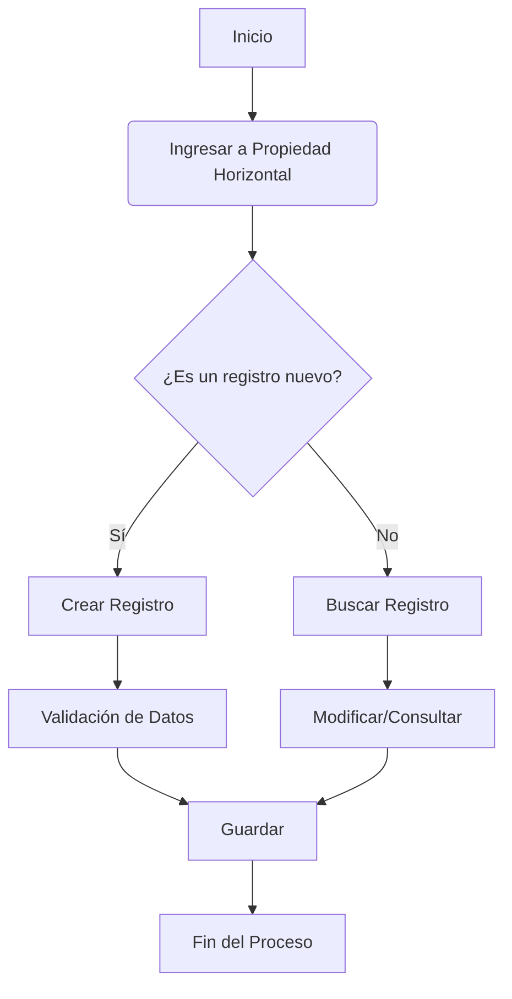

# Propiedad Horizontal

## 1. Introducción

### Objetivo
Gestionar y supervisar de forma integral la información y operaciones relacionadas con **Propiedad Horizontal** dentro del ecosistema de Inmobiliaria Velar.

### Alcance
Este módulo abarca la creación, consulta, modificación y seguimiento de todos los registros de Propiedad Horizontal, permitiendo un control centralizado.

### Beneficios
- Centralización de la información.
- Reducción de errores operativos.
- Trazabilidad total de las acciones.
- Agilización de los flujos de trabajo diarios.

### Casos de uso
- Registro diario de novedades.
- Generación de comprobantes y validaciones.
- Consulta de históricos y reportes operativos.

---

## 2. Conceptos básicos

> [!NOTE] Definición de Entidad
> En el contexto de **Propiedad Horizontal**, un registro representa una entidad única que atraviesa un ciclo de vida definido por reglas de negocio estrictas.

- **Estado Activo**: El registro se encuentra operando normalmente.
- **Estado Inactivo/Borrador**: El registro está en preparación o ha sido descontinuado.

---

## 3. Acceso al módulo

- **Ruta de acceso**: `Menú Principal → Propiedad Horizontal`
- **Permisos requeridos**: Rol `Operador`, `Administrador` o `Auditor`.
- **Ubicación en el sistema**: Panel de gestión operativa, ubicado típicamente en la barra lateral izquierda.

---

## 4. Interfaz de usuario

La pantalla principal de **Propiedad Horizontal** se compone de los siguientes elementos:

=== "Barra de Herramientas"
    - **Botón 'Nuevo'**: Permite inicializar un nuevo registro.
    - **Botón 'Exportar'**: Exporta la vista actual a Excel o PDF.

=== "Filtros Avanzados"
    - **Búsqueda por ID**: Búsqueda exacta del identificador.
    - **Filtros por Estado**: Desplegables para filtrar registros Activos, Pendientes o Cerrados.
    - **Rango de Fechas**: Búsqueda temporal.

=== "Tabla de Datos"
    - **Columnas**: ID, Nombre, Estado, Fecha de Creación, Acciones.
    - **Iconografía**:
        - ✏️ Editar
        - 👁️ Ver Detalle
        - 🗑️ Eliminar (solo Administradores)

---

## 5. Funcionalidades

### 5.1. Crear un registro de Propiedad Horizontal
**Objetivo**: Ingresar información nueva al sistema.  
**Cuándo utilizarla**: Al recibir una nueva solicitud o requerimiento.  
**Procedimiento**:
1. Hacer clic en el botón **Nuevo**.
2. Completar el formulario de datos básicos.
3. Adjuntar la documentación requerida.
4. Hacer clic en **Guardar**.

**Resultado esperado**: El sistema confirmará la creación y el registro aparecerá en estado inicial.

### 5.2. Actualizar registro
**Objetivo**: Modificar información existente.  
**Cuándo utilizarla**: Al ocurrir un cambio en las condiciones operativas.  
**Procedimiento**:
1. Buscar el registro deseado en la tabla de datos.
2. Hacer clic en el icono ✏️ (Editar).
3. Modificar los campos necesarios en el formulario.
4. Hacer clic en **Actualizar**.

**Resultado esperado**: Se guarda el historial de cambios y la información se actualiza visualmente.

---

## 6. Flujo de trabajo

---

## 7. Reglas de negocio

> [!IMPORTANT] Trazabilidad y Seguridad
> Todo cambio realizado en el módulo de **Propiedad Horizontal** genera automáticamente un registro en el log de auditoría. Los registros no se eliminan físicamente (Soft-Delete) para preservar la integridad referencial de los datos.

> [!WARNING] Restricciones de Estado
> Un registro en estado "Cerrado" o "Liquidado" no puede volver a modificarse a menos que se solicite un reverso directamente autorizado por gerencia.

---

## 8. Validaciones

| Campo | Obligatorio | Validación | Mensaje de Error |
|-------|-------------|------------|------------------|
| ID / Código | Sí | Único, Alfanumérico | `El código ingresado ya existe en el sistema.` |
| Fecha | Sí | Formato AAAA-MM-DD | `La fecha ingresada no es válida.` |
| Monto / Valor | Depende | Mayor a 0 | `El valor debe ser un número positivo.` |

---

## 9. Ejemplos prácticos

<strong>Escenario: Registro Incompleto</strong>

 
Un operador intenta guardar un registro sin cargar el documento obligatorio. El sistema prevendrá la acción, resaltará el campo en rojo y mostrará una alerta indicando: *"Documento anexo requerido"*. El operador deberá subir el archivo PDF y volver a intentar.

<strong>Escenario: Búsqueda Rápida de Datos</strong>

 
Para encontrar rápidamente los registros correspondientes al mes actual, el operador utiliza el panel de **Filtros Avanzados**, selecciona el mes actual en el selector de rango temporal y el sistema automáticamente actualiza la tabla de datos sin recargar la página.

---

## 10. Buenas prácticas

> [!TIP] Optimización del Tiempo Operativo
> - Utilice siempre la **Barra de Filtros** en lugar de buscar manualmente en las páginas de la tabla.
> - Verifique la completitud de los documentos antes de iniciar la carga en el sistema para evitar tiempos de espera y bloqueos innecesarios.

---

## 11. Preguntas frecuentes (FAQ)

¿Por qué el botón "Eliminar" está deshabilitado en mi sesión?

La eliminación de registros está restringida estrictamente al rol de Administrador. Si usted cuenta con rol de Operador, solo podrá solicitar la anulación o inactivación del registro a su supervisor.

¿Se pueden exportar los datos mostrados en la tabla?

Sí, utilizando el botón "Exportar" en la barra de herramientas superior. El sistema exportará únicamente los registros que correspondan a los filtros que tenga actualmente aplicados.

---

## 12. Solución de problemas

| Problema / Síntoma | Posible Causa | Solución Recomendada |
|-------------------|---------------|----------------------|
| **La pantalla principal no carga los datos** | Error de red o conexión temporal | Refrescar la página pulsando `F5`. Si el problema persiste, contactar a soporte IT. |
| **Error: "Permisos Insuficientes"** | Su perfil no autoriza esta acción particular | Solicitar al administrador del sistema la revisión y ampliación de privilegios. |
| **Los datos exportados no coinciden** | Los filtros no estaban debidamente aplicados | Verificar que la tabla en pantalla muestre la información correcta antes de hacer clic en el botón Exportar. |
