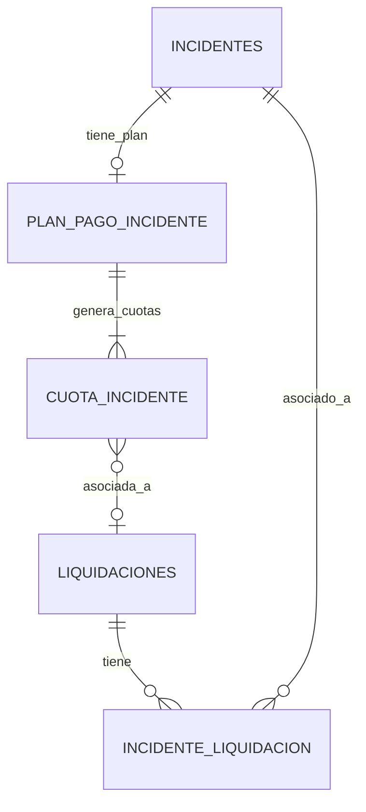

# Data Model: fix-incident-selection-button

**Date**: 2026-07-06 | **Branch**: `029-fix-incident-selection-button`

## Entidades Existentes (Sin Cambios Estructurales)

Este fix no modifica el modelo de datos. Todas las entidades ya existen y están operativas.

### Liquidación (`LIQUIDACIONES`)

| Campo | Tipo | Descripción |
|-------|------|-------------|
| ID_LIQUIDACION | SERIAL PK | Identificador único |
| ID_CONTRATO_M | INT FK | Contrato de mandato asociado |
| PERIODO | VARCHAR | Período (YYYY-MM) |
| ESTADO_LIQUIDACION | VARCHAR | En Proceso, Aprobada, Pagada, Cancelada |
| VALOR_INCIDENTES | INT | Total de descuentos por incidentes |
| NETO_A_PAGAR | INT | Neto calculado |
| OBSERVACIONES | TEXT | Observaciones (incluye IDs de incidentes) |

### Incidente (`INCIDENTES`)

| Campo | Tipo | Descripción |
|-------|------|-------------|
| ID_INCIDENTE | SERIAL PK | Identificador único |
| DESCRIPCION_INCIDENTE | TEXT | Descripción del incidente |
| COSTO_INCIDENTE | INT | Costo total |
| ESTADO | VARCHAR | Aprobado, En Reparacion, Finalizado, etc. |
| ESTADO_PAGO | VARCHAR | Pendiente, Parcialmente Pagado, Pagado |
| ID_PROPIEDAD | INT FK | Propiedad asociada |
| ID_CONTRATO_M | INT FK NULLABLE | Contrato mandato (puede ser NULL) |

### Plan de Pago (`PLAN_PAGO_INCIDENTE`)

| Campo | Tipo | Descripción |
|-------|------|-------------|
| ID_PLAN_PAGO | SERIAL PK | Identificador único |
| ID_INCIDENTE | INT FK | Incidente asociado |
| VALOR_CUOTA | INT | Valor de cada cuota |
| NUM_CUOTAS | INT | Número total de cuotas |
| ESTADO | VARCHAR | Activo, Finalizado |

### Cuota (`CUOTA_INCIDENTE`)

| Campo | Tipo | Descripción |
|-------|------|-------------|
| ID_CUOTA | SERIAL PK | Identificador único |
| ID_PLAN_PAGO | INT FK | Plan de pago padre |
| NUMERO_CUOTA | INT | Número secuencial de cuota |
| VALOR_CUOTA | INT | Valor de esta cuota |
| ID_LIQUIDACION | INT FK NULLABLE | Liquidación asociada (NULL si libre) |
| ESTADO_PAGO | VARCHAR | Pendiente, Pagado |

### Relación Incidente-Liquidación (`INCIDENTE_LIQUIDACION`)

| Campo | Tipo | Descripción |
|-------|------|-------------|
| ID_RELACION | SERIAL PK | Identificador único |
| ID_INCIDENTE | INT FK | Incidente asociado |
| ID_LIQUIDACION | INT FK | Liquidación asociada |
| NUMERO_CUOTA | INT | Cuota específica |
| VALOR_DESCUENTO | INT | Monto descontado |
| ASOCIADO_POR | VARCHAR | Usuario que realizó la asociación |
| FECHA_ASOCIACION | TIMESTAMP | Fecha de la asociación |

## Relaciones

## Reglas de Negocio del Modelo

1. Un incidente puede asociarse a múltiples liquidaciones (una cuota por liquidación).
2. Una cuota solo puede asociarse a una liquidación a la vez (`ID_LIQUIDACION` es UNIQUE por cuota activa).
3. Solo incidentes con `ESTADO IN ('Aprobado', 'En Reparacion', 'Finalizado')` Y `ESTADO_PAGO != 'Pagado'` son elegibles.
4. Solo liquidaciones con `ESTADO_LIQUIDACION IN ('En Proceso', 'Aprobada')` pueden recibir asociaciones.
5. `VALOR_INCIDENTES` de la liquidación se recalcula como `SUM(VALOR_DESCUENTO)` de todas las relaciones activas.
