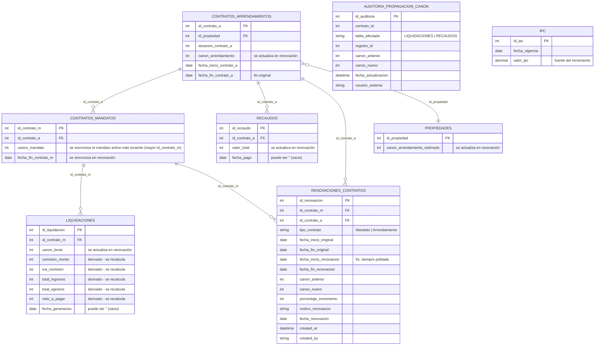

# Data Model: Renovación de Contratos (Debug de casting de fechas)

**Date**: 2026-09-13
**Feature**: 072-renovacion-contratos-debug
**Scope**: Fase 1 - Modelo de datos de la renovación

## Entidades y Relaciones

## Reglas de actualización por tabla

| Tabla | Campos actualizados | Condición de fila | Fuente del nuevo valor |
|-------|---------------------|-------------------|------------------------|
| CONTRATOS_ARRENDAMIENTOS | `canon_arrendamiento`, `fecha_inicio/y_fin` | contrato renovado | IPC (si aplica) o canon actual |
| CONTRATOS_MANDATOS | `canon_mandato`, `fecha_fin_contrato_m` | mandato activo más reciente (mayor `id_contrato_m`); si no hay activo → continuar sin error | idem canon |
| PROPIEDADES | `canon_arrendamiento_estimado` | propiedad del contrato | canon nuevo |
| LIQUIDACIONES | `canon_bruto` (+ derivados `comision_monto`, `iva_comision`, `total_ingresos`, `total_egresos`, `neto_a_pagar`) | `NULLIF(fecha_generacion,'')::date >= date_trunc('month', %s::date)` | canon nuevo |
| RECAUDOS | `valor_total` | `NULLIF(fecha_pago,'')::date >= date_trunc('month', %s::date)` | canon nuevo |
| AUDITORIA_PROPAGACION_CANON | insertar fila por cambio | SOLO filas realmente modificadas (valor cambiado); 0% o 0 filas futuras → sin registros | (ver campos) |
| RENOVACIONES_CONTRATOS | insertar log de renovación | al renovar | `fecha_inicio_renovacion = fecha_fin_original + 1 día` (helper `calcular_fecha_inicio_renovacion`) |

## Reglas de validación

1. **IPC (FR-001/FR-002)**: incremento = `valor_ipc` vigente **solo** si `duracion_contrato_a >= 12` meses Y existe valor IPC registrado. Si no → incremento 0%.
2. **Cubo de condiciones económicas**: comisión, IVA, totales y neto NO se editan a nivel de contrato; son derivados del canon en filas futuras.
3. **Fechas vacías**: `NULLIF(campo,'')` antes de `::date`; filas con fecha vacía se ignoran en propagación (no se rompe la transacción).
4. **Log de renovación**: `fecha_inicio_renovacion` siempre poblado (nunca `""`), usando `fecha_fin_original + 1 día` (helper `calculadora_contratos.calcular_fecha_inicio_renovacion`; nunca `sumar_meses`).
5. **Estados**: transición de contrato `vigente → renovado`; se sincroniza el mandato activo más reciente (mayor `id_contrato_m`); ante varios activos, el primero sin error; sin mandato activo NO bloquea la renovación (FR-009).
6. **Idempotencia (FR-011)**: reintentos de `renovar_arrendamiento`/`renovar_mandato` no generan dobles renovaciones ni dobles registros (decorador `@idempotent`).

## Notas de integridad

- Todas las queries usan placeholders `%s` (PostgreSQL) y se ejecutan en una única transacción atómica (ROLLBACK si falla) — patrón existente en `servicio_contrato_arrendamiento.py`.
- Los campos de auditoría `AUDITORIA_PROPAGACION_CANON` ya existen en BD (definidos en `063-fix-canon-propagation/contracts/sql-queries.md` Q7); no requieren migración.
- Tras el commit exitoso se invalida la caché del canon del contrato (`cache_estado_cartera` vía `CacheManager.invalidate_cache`); la invalidación NO bloquea ni revierte la transacción y tolera data obsoleta temporal (FR-012).
- La idempotencia (FR-011) se respalda en la tabla PostgreSQL `IDEMPOTENCY_KEYS` (vía `DatabaseIdempotencyStrategy`/`IRepositorioIdempotencia`), garantizando idempotencia entre sesiones/instancias (CHK031).
- Supuesto a validar: la transacción única de propagación no debe generar deadlocks frente a escrituras concurrentes en `RECAUDOS`/`LIQUIDACIONES`; se cubre con un test de concurrencia (CHK032).